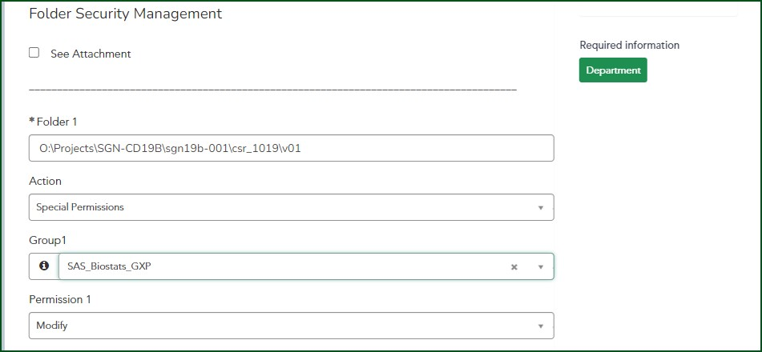
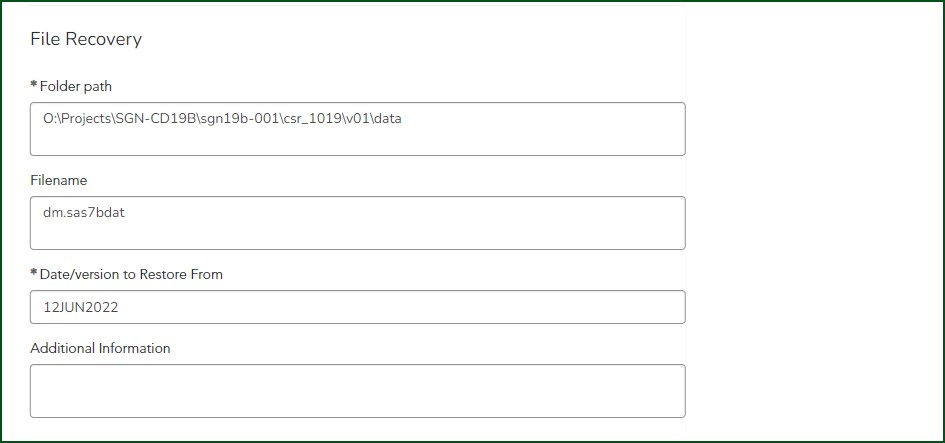

.. include:: admin_rsc.rst

SAS System Administration Requests
======================================================================

Initiate a SAS Administration Request via ServiceNow Portal
------------------------------------------------------------------------

.. raw:: html 

    <embed>

    
    

      

        
        Click <a style="background:blue;border:1px solid blue;padding:2px;border-radius:5px;bold;color:white;" href="https://seagen.service-now.com/seagen/?id=catalog&c=1bb014161b8bbb00aa2675d6cc4bcb5f&spa=1&item=e3113d70db6bf450bc541ae3399619da" target="_blank">here</a> to create a new request: 
         
         

         For IT support, please contact David Hudson and Thalia Salmon   
        

        

          <h5>ServiceNow Request Process</h5>
            <ol>             
                <li>Go to ServiceNow => Request Something => Support, then select SAS Sytem Administration Request</li>
                <li>Your name will be auto-populated in the "Requested by" box </li>
                <li>Select your department from the dropdown list</li>
                <li>Select types of request by checking appropriate boxes, multiple types are allowed</li>
                <li>Relevant fields will be displayed for the types of requests selected.</li>                
            </ol>
        

        

        Optional attachment template if needed:
        <button style="border: 1px solid blue;border-radius: 10px;background-color: #1E90FF;color:white; padding:5px;" onclick="window.open('attachment-template.docx')">Download Template</button>
        

    

    </embed>

Completion instructions by type
+++++++++++++++++++++++++++++++++++++++++++

    #. :ref:`section1_request`
    #. :ref:`section2_request`
    #. :ref:`section3_request` 

.. _section1_request:

User and Group Management
++++++++++++++++++++++++++++++++++++++++
This section is used for the followng activities:

    * Create a new user 
    * Modify group membership for existing user(s)
    * Create a new group 
    * Bulk user/group administration via attachment
	
.. csv-table:: 
   :widths: 10, 60, 10
   :header-rows: 1
   :file: section1.csv

To create a new user
*********************************

    #. Check "New User" checkbox.
    #. Enter user name in the text box
    #. Select group membership for the new user.
    #. Up to 4 new groups can be entered in a single form.  To create more than 4 users, please use attachment template.

    .. figure:: new_user.jpg

To create a new AD group
*************************************

    #. Check "New Group" checkbox.
    #. Enter group name.
    #. Up to 4 new AD groups can be entered in a single form.  To create more than 4 groups, please use attachment template.

    .. figure:: new_group.jpg

.. _section2_request:

Folder Security Management
++++++++++++++++++++++++++++++++++++++++++++++++++++++++++++

This section is used for the following activities:

    * Lock/unlock folders 
    * Add or remove a group's access to specified folders, and modify permissions and inheritance patterns of folders

.. csv-table::
   :widths: 10, 60, 10
   :header-rows: 1
   :file: section2.csv    

Special permission refers to security groups on the SAS file share that are not part of the the default security configuration. These are typically used to limit access to sensitive data. 
Contact IT (x2340) for guidance prior to submitting requests for new blinded study folders. 

See example below on how to request special permission for a folder:

.. _section3_request:

File Recovery
++++++++++++++++++++++++++++++++++++++++++++++++++++
This section is used for recovering file/folders

.. csv-table:: 
   :widths: 10, 60, 10
   :header-rows: 1
   :file: section3.csv  

See example below :

   
.. _workflow_request:    

Request Approval and Execution WorkFlow
-------------------------------------------
The workflow below describes the steps in the lifecycle of a SAS Administration request. Users should not modify the workflow displayed when a form is 
initiated unless instructed to do so by management or IT.

    #. Initiator completes the ServiceNow request form.
    #. System routes the request for department-level approval.
    #. System routes the request for system owner approval.
    #. System routes the request to IT for Execution.
    #. Initiator will be notified by ServiceNow when request has bee completed.
