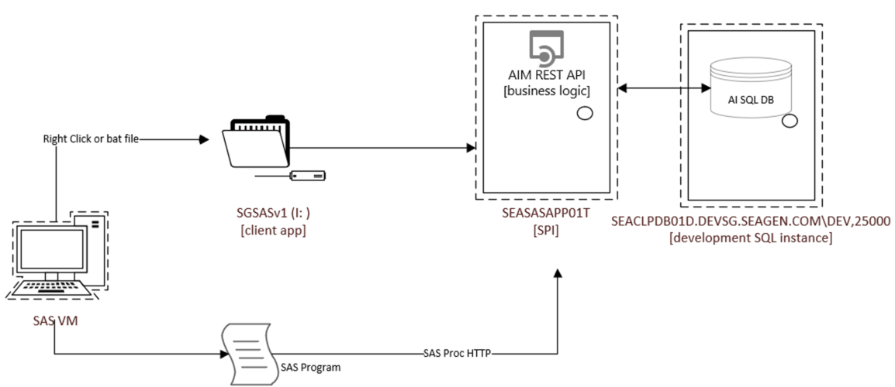

.. include:: aim_nav.rst

Analysis Index Manager (AIM) Version 6
============================================
The Analysis Index Manager (AIM) is a distributed application responsible for managing the auto populated fields in the Analysis Index (AI) Excel workbook, and the 
recording the AI metrics and metadata in a SQL database. The system consists of an ASP.NET Core Web application (API), a SQL Server database (DB), and a SAS macro interface. 
The application is invoked from a SAS macro, mcr_spi_run_aim, from a calling program under the analysis level utilities subfolder (typically [analysis]\\utilities\\ai\\pgms). 

The Analysis Index (AI) file acts as the user interface for the AIM application. Users track TLFs and datasets and through the QC process and AIM updates the derived columns in the file and 
records the data in a SQL database. The SAS programs that extract AI data into SAS datasets (e.g. get_ai, get_mrs) are independent SAS macros, outside the scope of AIM. 

.. toctree::
   :maxdepth: 3
   :caption: Contents

    Analysis Index File <ai>
    Migrate v3+ into v5+ <migrate>
    Running AIM <run>
    Schedule AIM for Nightly Execution <auto>
    AIM Functionality <flow>
    Status Assignment <status>
    Automation scripts <batch>
    AIM Database <sql>

System Architecture
-------------------------

