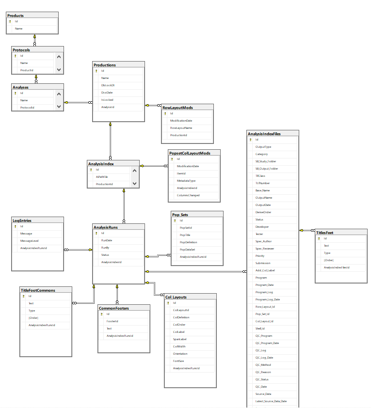

.. include:: aim_nav.rst
    
AIM SQL Server Database
==========================
All members of Statistical programming have read access to the SQL database. SPI manages SQL views to present the data to support various operations. 

Connect to Database from SAS
-------------------------------------
Users can access the database in SAS using a libname statement with the ODBC engine. 

* Development SQL Server:
  
    * server: SEACLPDB01D.DEVSG.SEAGEN.COM\\DEV,25000 
    * database: AIMS

* Production SQL Server:
   
    * server:  SEACLPDB01.SG.SEAGEN.COM\\PROD
    * database: AI

SQL Views
-------------------------
SPI manages a  library of views to support infrastructure initiatives dependent on the AIM v5 database. See available views below. 
.. list-table::
    :widths: 15 30
    :header-rows: 1

    * - SQL View
      - Description
    * - vw_analysis_index
      - Lists the analysis index level details needed to support metrics. 

Connect to databases from SAS
----------------------------------
Use the ODBC driver with the appropriate connection string to access the database from a LIBREF. Contact SPI if you are unable to authenticate against the DB. 

.. code-block:: python

    libname aim odbc noprompt="DRIVER=SQL Server;Server=<server>;DATABASE=<database>" SCHEMA=DBO access=readonly;

    

    data ai;
      set aim.vw_analysis_index;
    run;        

Database schema
-------------------------

