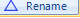
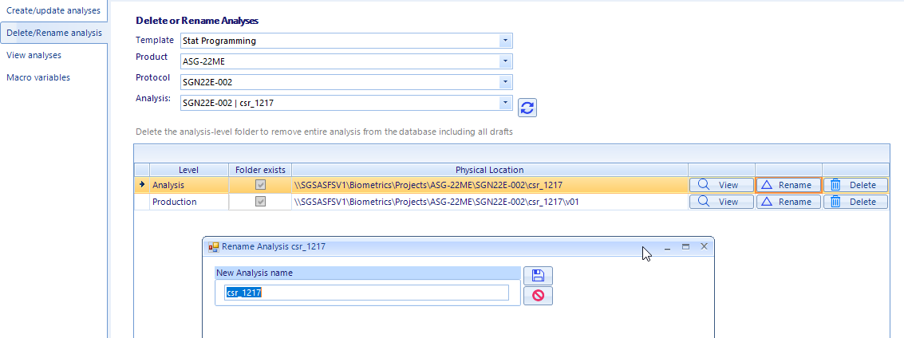
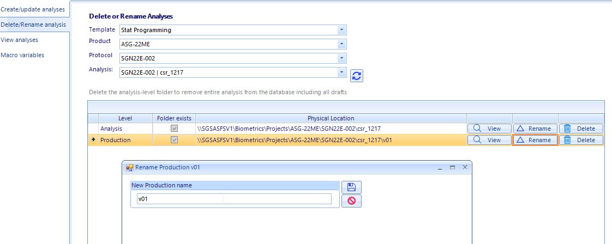
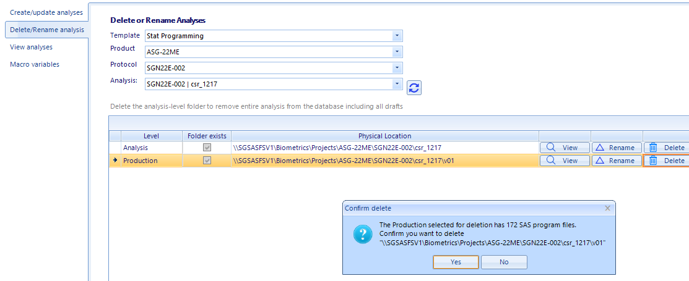

Rename or delete folders
===============================
As of ALM version 3.2, the user no longer has to delete the folders from the network prior to deleting the corresponding records in the database. Also renaming the production-level 
folders in now supported.

Rename an analysis
-------------------------------
#. Open the Delete/Rename analysis view from the left pane
#. Select the template, product, protocol, and analysis folder in the dropdown menu

    .. note::

        A check in the checkbox indicates that the folders exist on the file share. If folders do not exist, rename will be disabled.

#. Click the |rename| button for the record where Level is *Analysis*
#. Enter the new name in the dialog. The value will be validated to ensure the name is acceptable and it is unique within the parent folder.
#. Click the Save button. The app will update the file system and database with the new names. 

    .. warning:: 

        Do not rename folders created in ALM v2

Rename a production-level folder
------------------------------------
#. Open the Delete/Rename analysis view from the left pane
#. Select the template, product, protocol, and analysis folder in the dropdown menu
#. Click the |rename| button for the record where Level is *Production*
#. Enter the new name in the dialog. The value will be validated to ensure the name is acceptable and it is unique within the parent folder.
#. Click the Save button. The app will perform the following actions

    * rename the production level folder
    * update the database
    * update the initialization files

Delete an analysis or production-level folder
--------------------------------------------------
#. Open the Delete/Rename analysis view from the left pane
#. Select the template, product, protocol, and analysis folder in the dropdown menu
#. To delete just the production-level folder, click the |delete| button for the record where Level is *Production*
#. To delete the entire analysis, including all production-level folders, click the |delete| button for the record where Level is *Analysis*

.. warning::

    For both Rename and Delete, no user can have any files or even file explorer open within the target folders. It's safer to just close all instances of file explorer on 
    both you laptop and VM if you are unsure. If you still get a locked file/folder message, contact SPI as another user likely has file explorer open within the target folder.
