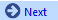
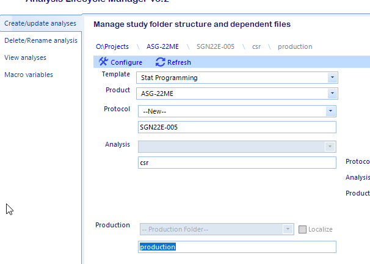
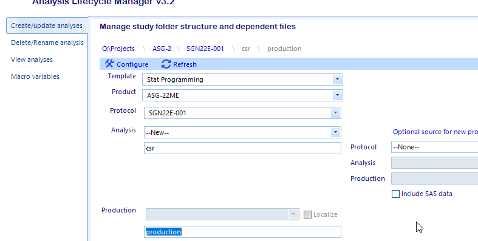
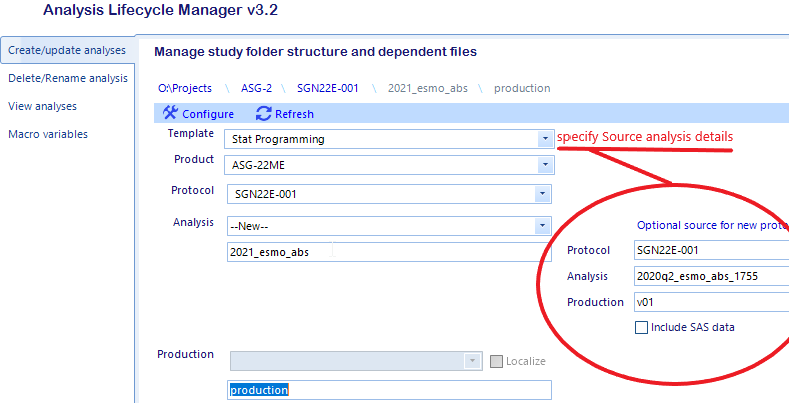
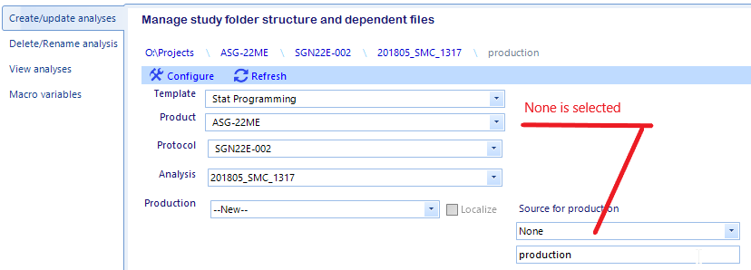
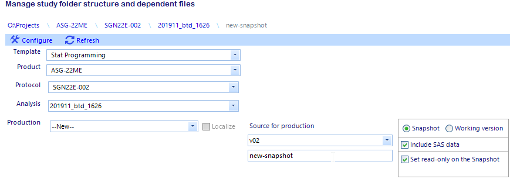
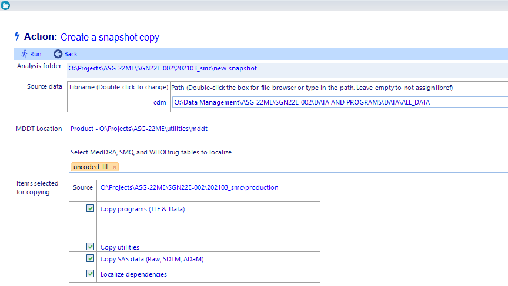
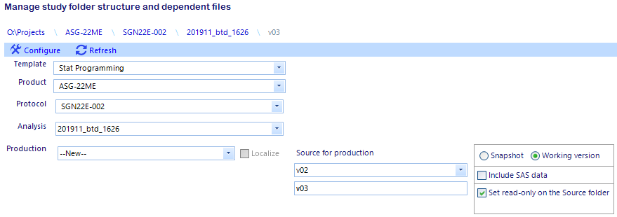

.. |rule| raw:: html

   

Create New Study Folders
=================================
ALM supports the creation of new protocol/project, analysis, and production level study folders. Users must contact SPI for new Product level folders. 

Starting from the *Create/Update analyses* view, follow the steps below for the desired action.

|rule|

:ref:`alm_new_protocol` | :ref:`alm_new_analysis`  | :ref:`alm_new_production`  

|rule|

.. note:: 

    The creation of folders on the U: drive for any new folder creation action is now optional. The default behavior, create folders on U: that correspond to 
    the folders on O:, can be overridden by unchecking the Create U: Drive Folders checkbox on the Create/Update analyses view. The U: drive folders can be created
    later by updating the existing protocol in ALM. This will not impact any existing work. 

    .. image:: no-u-drive.png

.. _alm_new_protocol:

Create a new protocol
---------------------------
#. Select a template, typically *Stat Programming* unless told by SPI to use a different template
#. Select a Product from the drop down menu
#. Select --New-- from the protocol drop down menu. This will enable free text fields to capture the names of new protocol, analysis and production level folders.         
#. Provide names for protocol, analysis, and production level folders. 

    .. note:: 

      * Confirm with DM and Biostatistics before creating the folders on the file system.
      * There is no Candid ID associated with the analysis level folder anymore
      * If the font appears red, the name for the folder is invalid and the app will not allow you to proceed.
      * The production-level folder will default to *production*. There should be a compelling reason for not using the default, but the app will allow you specify a valid folder name

#. Optionally select a source to copy production-level utilities and TLF and data program from. You can also copy data sets as well, but you must check the *Include SAS data* checkbox. This is not recommended
#. Click the *Configure* menu button
#. :ref:`alm_new_create`

New protocol
+++++++++++++++++++++

.. _alm_new_analysis:

Create a new analysis
-------------------------
#. Select a template, typically *Stat Programming* unless told by SPI to use a different template
#. Select a Product from the drop down menu
#. Select a Protocol from the drop down menu
#. Select --New-- from the analysis drop down menu. This will enable free text fields to capture the names of new analysis and production level folders.         
#. Provide names for the analysis and production level folders. 
#. Optionally select a source to copy production-level utilities and TLF and data program from. You can also copy data sets as well, but you must check the *Include SAS data* checkbox. This is not recommended
#. Click the *Configure* menu button
#. :ref:`alm_new_create`

New analysis without a source analysis
++++++++++++++++++++++++++++++++++++++++++++

New Analysis from based on an existing analysis
++++++++++++++++++++++++++++++++++++++++++++++++++
This action allows the user to create a new analysis from an existing analysis from a [protocol]\\[analysis]\\[production] within the same product. After the copy, 
the app will update the SAS program headers for files in pgms or testing folders (excluding utilities) in the following manner:

* If the program has a non-standard header, the app generates a new standard header, populates the fields based on the location of the program, and inserts an entry in program 
  history entry detailing the origin of the program. The app inserts the new header it at the top of the program file.
* If the program has a standard header, the app will update the path of the program and reset the program history, replacing all existing entries with entry detailing
  the origin of the program. 

.. _alm_new_production:

Create a new production-level folder
-----------------------------------------
#. Select a template, typically *Stat Programming* unless told by SPI to use a different template
#. Select a Product from the product-level folder drop down menu
#. Select a Protocol from the protocol-level folder drop down menu
#. Select an analysis from the analysis-level folder drop down menu
#. Select --New-- from the production=level folder drop down menu.         
#. The *Source for production* drop down menu populates with None and a list of available folders that can be used as a source. From here there are two options

    * Create a new production folder without copying any study files by selecting None and providing the name for the new production-level folder
    * Create a new working version (e.g. production) by selecting the source analysis and checking the *Working version* radio button. Select the options and provide a name for 
      the new folder. See screen shot below for an example of the UI.

#. Click the *Configure* menu button  
#. :ref:`alm_new_create`      

Create a new production-level folder
------------------------------------------
To create a new production-level folder not based on an existing folder, select None from the dropdown for *Source for production* and provide a folder name

Create a snapshot
----------------------------
A snapshot in ALM is a localized, functional copy, including non-standard folders, of the source production-level folder excluding *history* folders.

#. From the *Create/update analyses* screen, select the template, product, protocol, analysis folders in the drop down lists for the snapshot.
#. Select --New-- in the production folder drop down
#. Select the production folder to snapshot in the version source dropdown dialog

#. Click the *Snapshot* radio button from the dialog that appears. The default is to include everything except history folder and set read-only attribute on the snapshot. If you 
   intend to actually run programs from the snapshot, you can uncheck that the set read-only checkbox. You can remove the read-only attribute at any time from file explorer.

#. Provide a name for the snapshot and click Configure
#. Optionally modify the libname or path to the source data by double-clicking the value or inside the text box if the value is missing
#. The MDDT location reflects the location referenced by the source study and cannot be modified in the snapshot. 
#. Snapshot are automatically localized - select any MedDRA or WHODrug dependencies from the multi-select dropdown menu
#. Click the Run menu button 
#. If the application completes successfully, a dialog will notify the user and prompt them to click OK. This will return to the main form. If the application encountered an error
   the user is notified by a modal dialog box describing the error.

   .. note:: 

      A localization report and copy report are created in the [analysis]\\[production]\\utilities\\admin folder

Create a working version
-------------------------------------
A working version is a non-localized, functional copy of the standard folders of an existing version folder.

.. warning:: 

    Working version exists in order to allow users that require the functionality offered in the previous versions of ALM for a study-specific need. Users should get acceptance from leadership prior to using this function. 
    Typically users will maintain just a single production-level folder and use snapshots to preserve records of deliverables.

.. _alm_new_create:

The Action Form
++++++++++++++++++++++++++++++++++

After the |config| is clicked, a second form that appears allows to specify some run-time parameters.

#. Set the source data libname and path

#. Optionally update libname by double-clicking on the value of libname and entering the new libname in the dialog. To change the path, either double-click the text box or text 
    and use the file dialog to select any file in the folder that contains the source data. Alternately, the user can just type or paste the path into the text box. The path for the 
    source data libref does not need to actually exist. 

     .. image:: path.png

#. Select the location of the MDDT files for the study.

    .. image:: new-working2.png

#. If study objects are to be copied from a source, ensure the selected items are correct. If not use the back button to return the previous form and correct the selections.
#. Click the Run menu button 
#. If the application completes successfully, a dialog will notify the user and prompt them to click OK. This will return to the main form. If the application encountered an error
   the user is notified by a modal dialog box describing the error.

   .. note:: 

      If study elements were copied from a source analysis, a copy report are is created in the [analysis]\\[production]\\utilities\\admin folder.