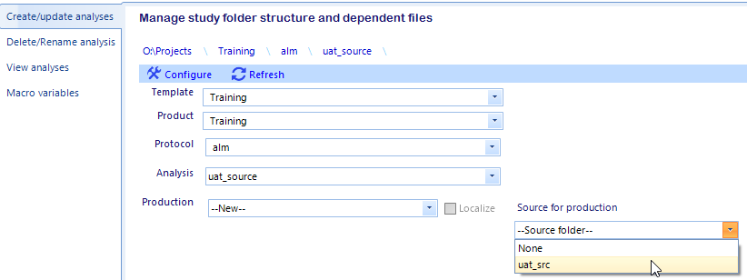
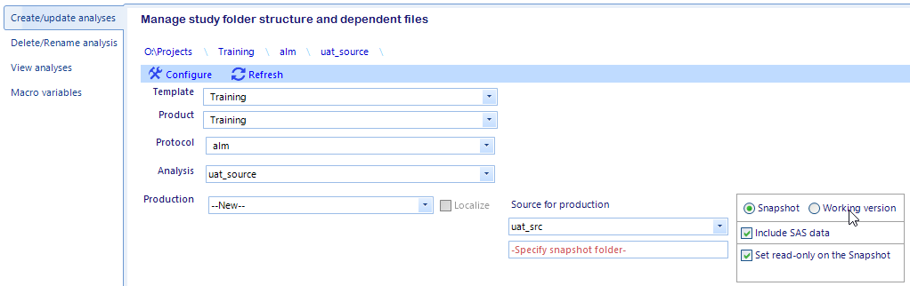

Create a snapshot
================================
#. From the *Create/update analyses* screen, select the template, product, protocol, analysis folders in the drop down lists for the snapshot.
#. Select --New-- in the production folder drop down
#. Select the production folder to snapshot in the version source dropdown dialog

    |snap1|

#. Click the *Snapshot* radio button from the dialog that appears. The default is to include everything except history folder and set read-only attribute on the snapshot. If you 
   intend to actually run programs from the snapshot, you can uncheck that the set read-only checkbox. You can remove the read-only attribute at any time from file explorer.

   |snap2|

#. Provide a name for the snapshot and click Configure
#. Snapshot are automatically localized - select any MedDRA or WHODrug dependencies from the multi-select dropdown menu
#. Click the Run menu button 
#. If the application completes successfully, a dialog will notify the user and prompt them to click OK. This will return to the main form. If the application encountered an error
   the user is notified by a modal dialog box describing the error.

   .. note:: 

      A localization report and copy report are create in the [analysis]\\[production]\\utilities\\admin folder