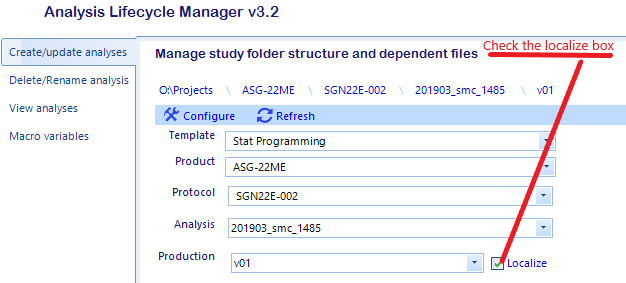
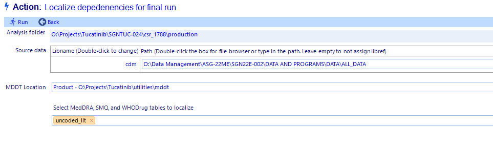

Update an production-level folder
===========================================
Updating an existing analysis has three use cases

#. *localize* an existing analysis
#.  update the folder tree with new structures defined in a template
#. fix corrupted link and env.sas files and replace missing folders

Localize an analysis
----------------------------
To localize an analysis means to copy all the dependencies exposed to the programming environment up the folder tree down into the corresponding utilities_[level] folder 
under the production-level folder. This maintains the hierarchy of the objects within the SAS environment and stores the version of the utility used at the time localization 
to prevent modification in case the analysis needs to be reproduced. Localization creates a report of all the objects that were copied under the production-level folder in 
[analysis]\\[production]\\docs\\admin.

The second screen allow the user to:
#. Update the path and libname to the source data
#. View the location of the MDDT files - it cannot be changed here. To change MDDT location, update the analysis before localizing.
#. Select MedDRA and WHODrug tables to include in the localization

.. warning::

    if you try to localize an ALM v2 analysis, you will get the warning below. You must first copy the v2 analysis into a new working version. 

    .. image:: error-local.png