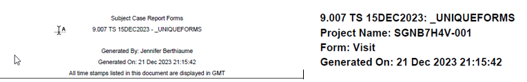

.. include:: nav.rst

Annotated CRF
===================================
Once the specification file is complete, the programmer calls mcr_spi_sdtm_crf_annotator with the action=A parameter to apply the SDTM annotations to the unique CRF pdf. 
The programmer can then manually update the PDF using Adobe Acrobat to finalize update the positions the annotations optimally. Additionally, annotations with duplicate target 
where Offset=0 and annotations where the label could not be located are stacked in the upper right margin of the first page of their target form. 

Generating the Annotated CRF PDF
-----------------------------------------
The programmer creates the annotated PDF by setting the action parameter to A, and passing the specification file and the blank unique CRF PDF from DM to the macro. The app 
creates the annotated PDF as [CRF location]\\[CRF file name]-annotated.pdf. See example macro call to generate the file.

.. code::

    %mcr_spi_sdtm_crf_annotator(
                spec_file       =O:\stat_prog_infra\testing\crf-annotator\dotnet\src\docs\crfs\sgnb7h4v\specs.xlsx  
                ,in_unique_crf  = O:\stat_prog_infra\testing\crf-annotator\dotnet\src\docs\crfs\sgnb7h4v\acrf.pdf
                ,action         = A);

Manual Updates to the Annotated CRF
-----------------------------------------------
The final PDF requires additional editing on behalf of the programmer. To edit the PDF,

#. Open the PDF in Adobe Acrobat
#. Add the Object Selector to the Toolbar

    #. Right-click the toolbar and select Customize Quick Tools
    #. Expand the Rick Media tab in the Choose Tools to Add menu
    #. Highlight the  |select| then click the |add| button to add the tool to the Quick tools toolbar

#. To enable editing of the annotations, Click the |select| tool in the quick tools. The annotations will display the Field# (e.g. |id| )
#. Edit the fields as needed. 

    .. note:: 

        To move fields to a different page in the document, use Cut/Paste. Do not attempt to drag annotation across page boundaries.

#. When complete, turn off the object selector by clicking another tool, the |edit| tool for example, though other tools will work as well

Unique CRF PDF
---------------------
The scope of this application is limited to the unique CRFs PDF file generated by Data Management. Only files in this format can be used by the application. 
The file can be identified by the heading similar to the one below on the first page and the pattern of the form headings at the top of the unique CRF. See 
examples below.

