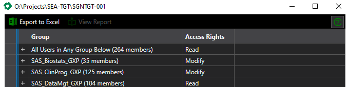
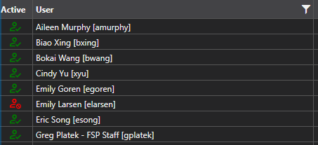
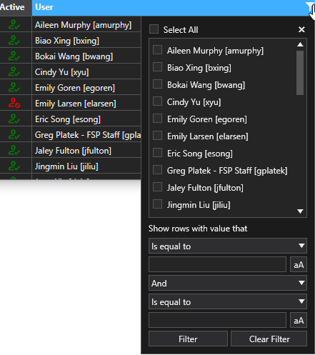

Directory Access Viewer
=====================================
Right-click a folder or the background inside of a folder and select *View user access*. The app will build a list of users in the background (which may take a minute) and 
display the list collapsed by group in a UI.

Group level
-----------------------
The app opens with a collapsed list of groups and their access level that exist for the selected folder. This can be used to assist in the completion of CS-096 requests 
when the group is not known. 

User Level
-------------------
Expand the group to see the members. Each record contains an account status indicator user icon (green for active, red for deactivated), the user's display name and account.

Filter functionality can be enabled to identify a specific user

Export to Excel
------------------------
Content of the UI can be exported to Excel using the export feature. 

Dependencies
---------------------
The app requires the user to have the registry keys for both Directory and Directory background installed. The app also requires Microsoft .NET Core 3.1 runtime. SPI (Shawn) 
or Vamsi can provide support for the VM by installing the files locally from here: \\\\sgsasv1\\Infrastructure\\admin\\installers\\user-access-viewer. A help desk ticket for 
getting a package available on the Seagen Portal and automating the distribution to all SAS VMs is currently with IT. 

.. note:: 

   Only users that need this software should request it explicitly from SPI or Vamsi at this time. 