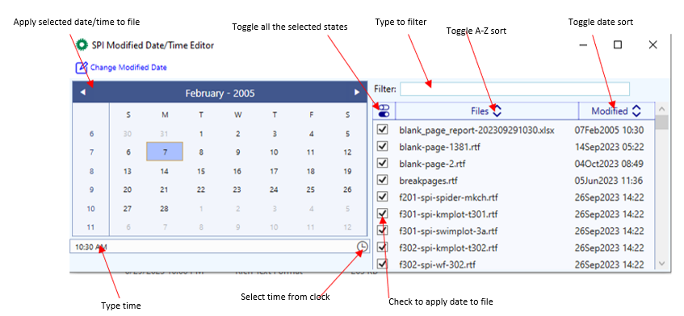

File Attribute Editor (SPI Only)
=======================================
The File Attribute Editor(FAE) is a Windows desktop client application that allows users to modify file attributes, currently Last Modified date and time, for the 
purpose of preparing test data with dependenencies on file attributes. The app will align creation and accessed dates if modified is set to an date earlier than the 
current values. 

.. warning:: 

    Only members of SAS_Infrastructure_Write are able to open the application. 

Useage
---------------------
#. Be a member of SAS_Infrastructure_Write
#. Download and install the Context Menu **File Attribute Editor** from the `context menu library <http://sgcpapp1/cp/programming/registry/library.html>`__
#. Invoke the applcation from the context menu:

  * Right-Click on a file to edit a single file and select *Edit file attributes* 
  * Right-click in the background of a directory to load all the files into the editor. The filter box and checkbox can be used to restrict which files are updated. 

