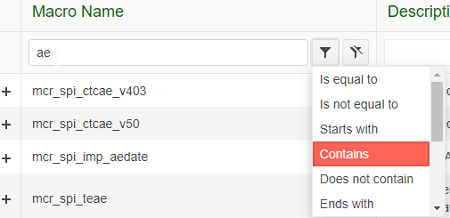
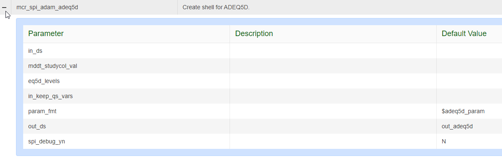

.. include:: nav.rst

Viewing Macros 
====================
Browse for macros using the text filters above either the macro name or description. By default, the filter type is set to 'contains' and is case-insenstive. The filter type 
can be changes using the filter select button |filteron|. Remove a filter by using the filter clear button |filteroff|.  

View the Parameters, Descriptions, and Defaults
-----------------------------------------------------
The |expand| button to the left of the macro displays the available paramters, descriptions (if recorded by the devloper), and any default values. 

Command Buttons
-----------------------------------------------
The application has 3 command buttons enabled for all users

#. |copy| - copies the macro parameters into the user clipboard. Use Paste to paste the contents of clipboard into your SAS program editor.
#. |preview| - displays the macro parameters in the format they will be captured in the clipboard. Users can also optionally copy the parameters to the clipboard using the 
               copy button exposed in this control. 
#. |ug| - opens the user guide in the SPO site. 