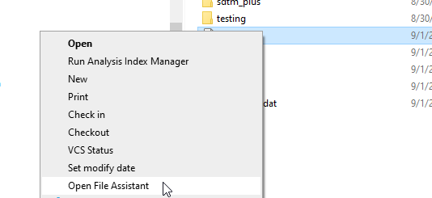
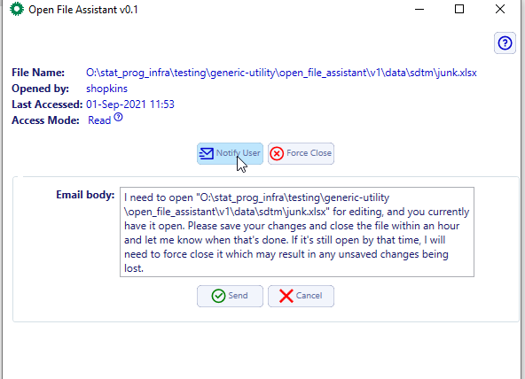
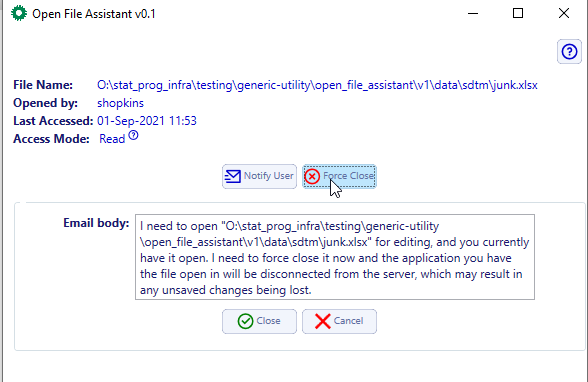

Open File Assistant
===========================
The Open File Assistant(OFA) is a .NET core application that enables non-admin users to manage locked files on the SAS file server. The application is invoked from 
the context menu (right-click) for any file under \\\\SGSASV1\\Biometrics, e.g. the O: drive. The app will not work outside of this location. The application allows 
a user to either send an email message to the user with the file open to prompt them to close the file, or disconnect the file from the server, effectively closing the file. 

Start the application
------------------------
In order to use the application, SPI must first install the context menu in the registry of the your SAS VM. A help desk ticket is pending to automate this for all SAS VMs and 
to create an installer package will be available on the Company Portal for use on laptops. Meanwhile, if you don't have the menu item and want the application, contact SPI (shawn).

To invoke the application, right click on a file on the O: drive and click *Open File Assistant*. This calls an API running as a privileged account and returns details about the 
file to the UI app that open in the client. 

The application displays the following data points: 

    #. user that has the file open
    #. the `last-accessed date <https://support.accessdata.com/hc/en-us/articles/204353955-File-Created-File-Accessed-File-Modified?mobile_site=true>`__
    #. the level of access the user has on the file 

The application allows two actions; notify the user to close the file or force the file closed. 

Send a notification to close a file
-----------------------------------------
Click the |notify| button to display a default email template that will be sent to the user with the file open from the user that invoked the application. Modify the email 
text accordingly, specifically the amount of time before you need to close the file. Click the |send| button to send the email to the user. You can leave the app open 
to close the file if the user is unavailable. 

Force close a file
-----------------------------
Click the |close| button to  display a default email template that will be sent to the user. After you click |force| the app  disconnects the process that has the file locked from the server, allowing the file to be modified. The 
user that had the file open, will still have the file loaded in the client application, but it is not attached to the server. The app sends the email notification to the user 
with the email text and a warning against saving the file directly as it could overwrite new content. 

Access levels
---------------------
There are two types of access: Read and Write. Generally Read access does not lock a file for editing. For example, .SAS file open in Enterprise Guide can be edited by 
another user. There is a exception for SAS Datasets. 

.. note:: 

    If a user has a SAS dataset open in SAS Viewer 9.1 or EG, the access level may appear as Read, but users are 
    unable to overwrite the dataset. In this cases, use |close| to disconnect the file and allow the dataset to be overwritten. In some cases, the dataset may have a 
    member lock that continues to persist in the SAS application, typically the result of an orphaned process (job terminates unexpectedly). In this case, OFA will not disconnect the file. IT (Vamsi) 
    will need to terminate the process on the SAS app server.  

Another harmless artifact is it's possible that you can run OFA on a file you do not have open and the app will say you have the file open in Read mode. This is caused by the app 
itself querying the file. There is no lock however. 

