Patient Profile Generator
=====================================

Contents
---------------------

`1. Overview of the System <#overview-of-the-system>`__ 

`2. Scope <#scope>`__ 

`3. Prerequisites <#prerequisites>`__ 

`3.1 Study Data Specification File <#study-data-specification-file>`__ 

`3.2 Data Preparation <#data-preparation>`__ 

`3.2.1 Lab Data <#lab-data>`__ 

`3.2.2 Locations of Pre-processed Lab and Other Data <#locations-of-pre-processed-lab-and-other-data>`__ 

`4. Using the Application <#using-the-application>`__ 

`4.1 Creating a New Analysis <#creating-a-new-analysis>`__ 

`4.1.1 From an Excel File <#from-an-excel-file>`__ 

`4.1.2 From an Existing Pat Profile Template <#from-an-existing-pat-profile-template>`__ 

`4.2 Main Patient Profile Form <#main-patient-profile-form>`__ 

`4.2.1 Modifying the Analysis-Level Attributes <#modifying-the-analysis-level-attributes>`__ 

`4.2.2 Modifying the Run-Time Attributes (Report Settings) <#modifying-the-run-time-attributes-report-settings>`__ 

`4.2.3 Creating and Loading Subject Lists <#creating-and-loading-subject-lists>`__ 

`4.2.4 Modifying the Order of Datasets <#modifying-the-order-of-datasets>`__ 

`4.2.5 Modifying the Properties of a Dataset <#modifying-the-properties-of-a-dataset>`__ 

`4.3 Add Dataset Metadata from Outside the Template <#add-dataset-metadata-from-outside-the-template>`__ 

`4.3.1 From a SAS Dataset <#from-a-sas-dataset>`__ 

`4.3.2 From the Database <#from-the-database>`__ 

`4.4 Track Changes <#track-changes>`__ 

`4.5 Generate Report <#generate-report>`__ 

`4.5.1 RTF <#rtf>`__ 

`4.5.2 Create SAS Program <#create-sas-program>`__ 

`5. Document Version History <#document-version-history>`__ 

1. Overview of the System
---------------------

The patient profile generator is a client/server Windows desktop application that leverages the Medidata Rave database via Study Data Specification (SDS) files (or the equivalent thereof for SDTM and/or ADaM data sets) and previous analysis patient profile setup work to facilitate the creation of patient profile reports. The reports produced by this application are subject-level RTF data listings by topic (domain) within each patient, and most often used to inform Safety Monitoring Committee (SMC) reviews, especially on Seagen's Phase 1 trials.

This application can be executed in user’s laptop and virtual machine (VM) environment, using VM is highly recommended. The system consists of a .NET application that provides the user interface, a SQL Server database that stores the analysis metadata, and a stored, compiled SAS macro to generate the report.

2. Scope
---------------------

While the patient profile generator may be used for any analysis that has SAS datasets, the intended scope includes Medidata Rave protocols with properly formatted SDS files. The application can also be used in a similar manner with SDTM or ADaM data sets, ideally with SDS-like metadata files to facilitate the setup. Such SDS-like metadata files can be automatically produced from Seagen standards SDTM and ADaM specifications called Master Data Definition Tables (MDDTs) using departmental macro `mcr_spi_mddt2sds <https://seagen.sharepoint.com/sites/BMInfra/Shared%20Documents/SPI%20Analytical%20Utilities/MDDT/mcr_spi_mddt2sds/user_guide_mcr_spi_mddt2sds.docx?web=1>`__ (see `Section 4.1 <#study-data-specification-file>`__).

The SQL database will use Active Directory to authenticate users. Only members of statistical programming will have access to the database. Users will only be able to delete an analysis that they create, though any member of Validated SAS may work on the metadata for any analysis in the database. Backups of the database are scheduled nightly.

3. Prerequisites
---------------------

3.1 Study Data Specification File
+++++++++++++++++++++++++++++++++++++++++++++

The most critical dependency is the Study Data Specification (SDS) file provided by data management for raw data or generated automatically via SPI department macro mcr_spi_mddt2sds for SDTM and ADaM data sets (see `user guide <https://seagen.sharepoint.com/sites/BMInfra/Shared%20Documents/SPI%20Analytical%20Utilities/MDDT/mcr_spi_mddt2sds/user_guide_mcr_spi_mddt2sds.docx?web=1>`__). There are two critical sections in the document:

-  Forms worksheet – identifies the data set name and label that correspond to the datasets extracted from Rave

-  Fields worksheet – Identifies the enterable eCRF fields and their order within each form

Figure 1 and Figure 2 is an example of SDTM and ADaM data generated SDS file. If the SDS file was generated from the SDTM MDDT, the application uses SDTM_PLUS datasets, the application uses SDTM_PLUS datasets as its source which contains variables in both the main and the supplemental qualifier data sets.

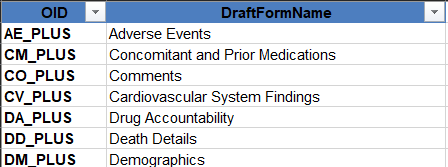

Figure : Form worksheet for SDTM data set

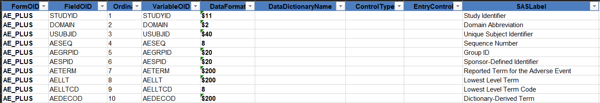

Figure 2: Fields worksheet for SDTM data set

3.2 Data Preparation 
+++++++++++++++++++++++++++++++++

3.2.1 Lab Data 
~~~~~~~~~~~~~~~

Medical monitors and other PP audiences often prefer to view lab data horizontally (left to right) instead of in the vertical (normalized) structure that is common for most source data and for SDTM and ADaM. Users of the PPG can transpose lab data from vertical to horizontal format using SPI department macro mcrtransposelbgraded. The data would list all lab tests per subject per visit and present test result by standard unit. Prior to calling this macro, users may need to create essential variables such as TESTKEY when generating PPs based on raw data or keep variables on LB_PLUS data set when based on SDTM data ; SPI macros are available specifically for this purpose. Please refer to details from the `user guide <https://seagen.sharepoint.com/sites/BMInfra/Lists/ADaMSDTM%20Macros/DispForm.aspx?ID=40&e=QJsH8n>`__ for mcrtransposelbgraded.

In addition to transposing lab data to horizontal format, presenting it by panel is recommended. In the same pre-processing step, users can further split lab data by each panel to use them in patient profiles.

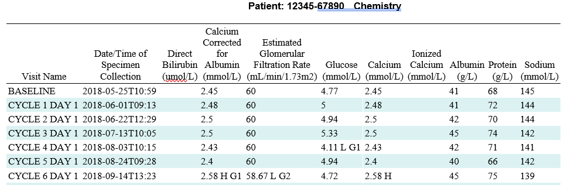

Figure 3: Example of lab data in patient profile

3.2.2 Locations of Pre-processed Lab and Other Data
~~~~~~~~~~~~~~~~~~~~~~~~~~~~~~~~~~~~~~~~~~~~~~~~~~~

If users want to pre-process data sets to present in their patient profiles, for example, transpose data sets for lab or vital sign forms or combine multiple data sets into one (e.g., Enroll and Demographic form; multiple PK data sets for different timepoints), they would do so in Seagen's standard SAS environment and save the processed data sets as source data sets for patient profile in the standard raw, SDTM, or ADaM data directory for each type of source data sets in the patient profile analysis directory. Note: give such data sets a different name (e.g., <ppg_data set>) and do not overwrite raw data sets from EDC or other sources.

4. Using the Application
--------------------------------------

The application is invoked by double-clicking the “patient profile generator” shortcut in the department-level infrastructure folder (`I:\\apps_stratus <file:///I:/apps_stratus>`__). This displays the user interface. The metadata defined for an analysis via the tool by each user is saved in a SQL Server database. A compiled SAS macro, called from the user interface, generates the patient profile output and a SAS program to generate the output in the SAS environment.

4.1 Creating a New Analysis 
+++++++++++++++++++++++++++++++++++++++

Users create a new analysis by clicking the “Create template” -> “New template” menu item and selecting either “From an Excel File” or “From an existing Pat Profile template”.

4.1.1 From an Excel File
~~~~~~~~~~~~~~~~~~~~~~~~

If this is a new protocol, the first step is generally to create a new raw patient profile from a SDS file. This will bring up the “Add New Study” form. Below is an example:

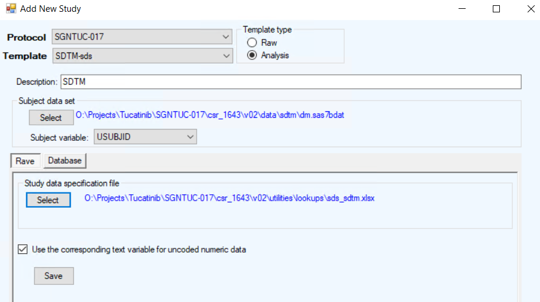

Figure 4: Create a new study from Excel file (SDS file)

The user identifies the location of the subject-level source data set and the SDS file for the protocol. This will also provide the default location of the analysis-level folders so the patient profile reports and SAS logs may be routed appropriately.

The application will default the subject-level variable to "SUBJECT", "USUBJID", "SUBJID", or "PTNO", depending on which variable exists in the subject-level data set. The subject-level variable or dataset can be changed at any time during the life of the analysis.

The checkbox “Use the corresponding text variable for uncoded numeric data” will store the decoded variable in the metadata instead of the \_STD variable. An example is AE outcome. In Rave, this variable will use the OUTF dictionary and the enterable variable will be a dropdown list. The value is stored as an integer. However, in the output the user most likely wants the decoded value for outcome, not an integer. It is recommended that this box always be checked, unless there is some compelling reason to use the \_STD values.

Once the selections are made, click Save to write the new analysis to the database.

4.1.2 From an Existing Pat Profile Template
~~~~~~~~~~~~~~~~~~~~~~~~~~~~~~~~~~~~~~~~~~~

If the raw metadata for profile has been uploaded and modified to meet the user’s expectations, it is much faster to use those specifications as the starting point for the analysis profiles. It is recommended to use “Raw” template type moving forward but there is no major difference between “Raw” and “Analysis” template type. It is the users’ choice to name their template as “Raw” or “Analysis” and the type will be displayed next to the template (e.g., SMC (RAW)) created under “Select Study” as shown in Figure 3 ). In most cases, the analysis patient profile metadata will be created by coping and updating the raw patient profile metadata. To do this, click “Create template” -> “New template” menu item and select “From an existing Pat Profile template”. This will bring up the form displayed below.

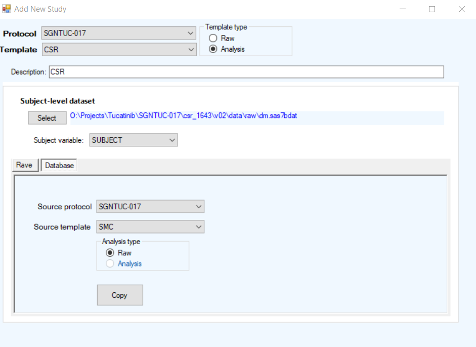

Figure 5: Create a new study from existing patient profile template

The user will give the new analysis a name, type, description, and subject-level data set in the same way as a new protocol from Rave. Instead of selecting an SDS file as the source of the metadata, the user will select an analysis that exists in the patient profile database. Click copy to create an exact copy of the metadata under the new analysis.

4.2 Main Patient Profile Form
+++++++++++++++++++++++++++++++++++++++++

Once a protocol is created in the database, its metadata can be loaded into the main form from the tree node on the left-hand side. Here the user can change the metadata stored in the database for an analysis and modify the run-time properties for the report. Users can specify the location of source data and output in the “Data Folder” and “Output Path”. For SDTM data, the application uses SDTM_PLUS data sets therefore the Data Folder has to be specified pointing to the corresponding directory.

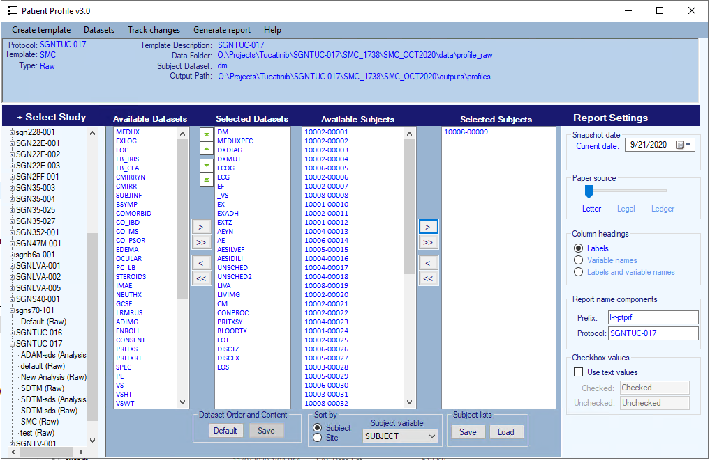

Figure 6: Main form

4.2.1 Modifying the Analysis-Level Attributes
~~~~~~~~~~~~~~~~~~~~~~~~~~~~~~~~~~~~~~~~~~~~~

To modify analysis-level attributes at the top of the screen, hover the mouse over the value and click. The template description, data folder, subject dataset, and output path may all be modified and saved to the database.

4.2.2 Modifying the Run-Time Attributes (Report Settings)
~~~~~~~~~~~~~~~~~~~~~~~~~~~~~~~~~~~~~~~~~~~~~~~~~~~~~~~~~

Run-time attributes are settings that must be set each time a patient profile report is generated. The default values will populate in the form each time an analysis is loaded in the form. These include the following attributes.

.. table:: Table 1: Run-time attributes

   +-----------------+---------------------------------------------------------------------------------------------------------------------------------------------------------------------------------------------------------------------------------------------------------------+
   | Attribute       | Effect on output                                                                                                                                                                                                                                              |
   +=================+===============================================================================================================================================================================================================================================================+
   | Snapshot date   | The date, in DDMONYYYY format, appended to the footnote of the source data folder to indicate the date the data was extracted from the database. This must be set by the user at run time as the file attributes will generally not reflect the extract date. |
   |                 |                                                                                                                                                                                                                                                               |
   |                 | For track changes, current date and compare date need to be set up to reflect the snapshot date which will be presented in the output.                                                                                                                        |
   +-----------------+---------------------------------------------------------------------------------------------------------------------------------------------------------------------------------------------------------------------------------------------------------------+
   | Paper source    | The user can direct the output to letter, legal, or ledger paper size.                                                                                                                                                                                        |
   +-----------------+---------------------------------------------------------------------------------------------------------------------------------------------------------------------------------------------------------------------------------------------------------------+
   | Column headings | Indicates what values to use for the data set and variable headings. If using Label and variable names, the labels will be displayed first, followed by the data set or variable name enclosed within brackets.                                               |
   +-----------------+---------------------------------------------------------------------------------------------------------------------------------------------------------------------------------------------------------------------------------------------------------------+
   | Prefix          | The first element of the three-part name of the patient profile report. By default, the prefix is l-[r \| a]-ptprf. This field is required but could be just “l” to indicate listing.                                                                         |
   +-----------------+---------------------------------------------------------------------------------------------------------------------------------------------------------------------------------------------------------------------------------------------------------------+
   | Protocol        | This is the second element of the three-part name of the patient profile report. By default, the value is the protocol name.                                                                                                                                  |
   +-----------------+---------------------------------------------------------------------------------------------------------------------------------------------------------------------------------------------------------------------------------------------------------------+
   | Checkbox values | For variables entered in Rave using the Checkbox Control, the user can optionally display the 1 and 0 values as the value displayed in “Checked” and “Unchecked”. Check “Use text values” then specify the values to use. Missing values are acceptable.      |
   +-----------------+---------------------------------------------------------------------------------------------------------------------------------------------------------------------------------------------------------------------------------------------------------------+

4.2.3 Creating and Loading Subject Lists
~~~~~~~~~~~~~~~~~~~~~~~~~~~~~~~~~~~~~~~~

Once subjects are moved to the Selected subjects list box, the user can save the list by clicking Save in the subjects lists control, providing a name for the list, and clicking save from the Save dialog. To load a saved list, click Load, select the list to be loaded, and click load from the load dialog.

4.2.4 Modifying the Order of Datasets
~~~~~~~~~~~~~~~~~~~~~~~~~~~~~~~~~~~~~

By default, the order of the dataset is defined by the AFM used to initially load the protocol metadata. This can be modified by moving the desired dataset from “Available Datasets” to “Selected Datasets”, highlighting a dataset, and using the Up/Down arrows to change its position within the report. The default order of the “Selected Datasets” can be restored by clicking “Default” in the dataset order and content. The order the datasets appear in the main form will define the appearance of the report, but the order will not be committed to the database until the user clicks Save.

4.2.5 Modifying the Properties of a Dataset
~~~~~~~~~~~~~~~~~~~~~~~~~~~~~~~~~~~~~~~~~~~

The bulk of the work associated with generating patient profiles is customizing the dataset metadata. To invoke the dataset editor form, double-click a dataset in the “Selected Datasets” list box. The metadata for the data set will be displayed as below:

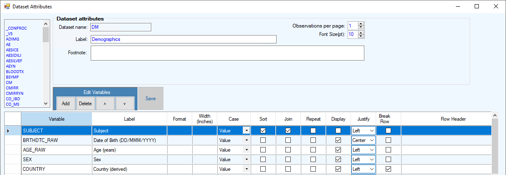

Figure 7: Modifying dataset attributes

The dataset can be sorted by datetime by including the numeric date variable. To do this, click on “Add”, then select the numeric date variable (e.g. CMSTDTC) from the pop-up window and click on “OK”. The numeric date variable will be displayed in the above “Data Attributes” form. To sort by this datetime variable but not display it in the final patient profile, check the “Sort” box and uncheck the “Display” box, and set the “Format” as 8 to sort simply as an integer. However, if you use the character date variable that is included in the input dataset by default (e.g. CMSTDTC_RAW), the date variable may not be sorted as integers as you expected if the format is DD/MMM/YYYY in most of studies.

The table below describes each attribute and its effect on the output file.

.. table:: Table 2: Edit dataset controls

   +-----------------------+----------------------------------------------------------------------------------------------------------------------------------------------------------------------------------------------------------------------------------------------------------------------------------+
   | Form control          | Output attribute effected                                                                                                                                                                                                                                                        |
   +=======================+==================================================================================================================================================================================================================================================================================+
   | Data set label        | Label of the dataset used in the second level title in the report.                                                                                                                                                                                                               |
   +-----------------------+----------------------------------------------------------------------------------------------------------------------------------------------------------------------------------------------------------------------------------------------------------------------------------+
   | Observations per page | The number of observations to include on a single page of output for a dataset. Use this to control observations breaking across multiple pages when more than one row of variables is defined.                                                                                  |
   +-----------------------+----------------------------------------------------------------------------------------------------------------------------------------------------------------------------------------------------------------------------------------------------------------------------------+
   | Font size             | The font size in points to display the dataset.                                                                                                                                                                                                                                  |
   +-----------------------+----------------------------------------------------------------------------------------------------------------------------------------------------------------------------------------------------------------------------------------------------------------------------------+
   | Footnote              | Dataset-specific footnote that will appear as the first footnote (after page x of y) in the output.                                                                                                                                                                              |
   +-----------------------+----------------------------------------------------------------------------------------------------------------------------------------------------------------------------------------------------------------------------------------------------------------------------------+
   | Add variable          | Displays a form with all the variables in the corresponding SAS dataset that do not exist in the analysis metadata that may be added to database. This is useful for adding derived variables or variable for sorting that will not be displayed.                                |
   +-----------------------+----------------------------------------------------------------------------------------------------------------------------------------------------------------------------------------------------------------------------------------------------------------------------------+
   | Delete variable       | Removes a variable from the study metadata. Starting from version 3.0, it will allow users to remove multiple variables at the same time by pressing “CTRL” and clicking variables simultaneously to select them.                                                                |
   +-----------------------+----------------------------------------------------------------------------------------------------------------------------------------------------------------------------------------------------------------------------------------------------------------------------------+
   | Sort                  | Move variables up and down in the form to define the order in which the variables will appear in the output. Starting from version 3.0, it will allow users to sort multiple variables at the same time by pressing “CTRL” and clicking variables simultaneously to select them. |
   +-----------------------+----------------------------------------------------------------------------------------------------------------------------------------------------------------------------------------------------------------------------------------------------------------------------------+
   | Variable label        | Label to display in the output. Double-click the column heading to display the global search and replace window to modify all the labels in the dataset.                                                                                                                         |
   |                       |                                                                                                                                                                                                                                                                                  |
   |                       | You can use the \` character to cause a column heading to split at a specific location.                                                                                                                                                                                          |
   +-----------------------+----------------------------------------------------------------------------------------------------------------------------------------------------------------------------------------------------------------------------------------------------------------------------------+
   | Format                | Allows the user to specify a format for a variable. Currently only SAS supplied formats are supported. E.g. date9., mmddyy11.                                                                                                                                                    |
   +-----------------------+----------------------------------------------------------------------------------------------------------------------------------------------------------------------------------------------------------------------------------------------------------------------------------+
   | Width                 | Explicitly define the width in inches for a variable in the output. By default, the application will let the SAS System define the width.                                                                                                                                        |
   +-----------------------+----------------------------------------------------------------------------------------------------------------------------------------------------------------------------------------------------------------------------------------------------------------------------------+
   | Case                  | Value – displays the value as it exists in the dataset                                                                                                                                                                                                                           |
   |                       |                                                                                                                                                                                                                                                                                  |
   |                       | Title – uses the title case algorithm defined in the mcrmixedcase department macro                                                                                                                                                                                               |
   |                       |                                                                                                                                                                                                                                                                                  |
   |                       | Sentence – uses the sentence case algorithm defined in the mcrmixedcase department macro                                                                                                                                                                                         |
   +-----------------------+----------------------------------------------------------------------------------------------------------------------------------------------------------------------------------------------------------------------------------------------------------------------------------+
   | Sort                  | Uses the value to sort the data set in the output.                                                                                                                                                                                                                               |
   |                       |                                                                                                                                                                                                                                                                                  |
   |                       | For variables that contain numeric values (e.g., Sequence number), use the numeric type variable for both display and sort.                                                                                                                                                      |
   |                       |                                                                                                                                                                                                                                                                                  |
   |                       | If a datetime numeric variable is used for sorting, use the numeric date variable and apply the *BEST.* format and turn off display. Use the corresponding character variable for display in the output.                                                                         |
   |                       |                                                                                                                                                                                                                                                                                  |
   |                       | NOTE: Sort variables cannot be break variables. Sort variables should be moved to the top of the datagrid and grouped together. The application will enforce these rules.                                                                                                        |
   +-----------------------+----------------------------------------------------------------------------------------------------------------------------------------------------------------------------------------------------------------------------------------------------------------------------------+
   | Join                  | Join variables are the merge variables between corresponding datasets when Track Changes is used. The variables selected should uniquely identify the observation, if not, the application will issue a notice and use the position of the record to enforce uniqueness.         |
   +-----------------------+----------------------------------------------------------------------------------------------------------------------------------------------------------------------------------------------------------------------------------------------------------------------------------+
   | Repeat                | Causes the value to be displayed for each row of output for dataset with more than one row of variables on a page. E.g. AE might use AE sequence as a repeat variable. Repeat variables must be included as sort variables.                                                      |
   +-----------------------+----------------------------------------------------------------------------------------------------------------------------------------------------------------------------------------------------------------------------------------------------------------------------------+
   | Display               | Indicates if the variable will be displayed in the output. This is used to prevent the display of variables used only for sorting or merging for track changes.                                                                                                                  |
   +-----------------------+----------------------------------------------------------------------------------------------------------------------------------------------------------------------------------------------------------------------------------------------------------------------------------+
   | Justify               | Left, right, or center justifies the value in the output.                                                                                                                                                                                                                        |
   +-----------------------+----------------------------------------------------------------------------------------------------------------------------------------------------------------------------------------------------------------------------------------------------------------------------------+
   | Break row             | Indicates a new row should be started for the remaining variables should begin after the variable is printed on the row.                                                                                                                                                         |
   +-----------------------+----------------------------------------------------------------------------------------------------------------------------------------------------------------------------------------------------------------------------------------------------------------------------------+
   | Row header            | Indicates a new row should begin before the variable is printed with a secondary title displayed above the row. You do not need to use break row and row header together.                                                                                                        |
   |                       |                                                                                                                                                                                                                                                                                  |
   |                       | The subheading will appear of the variables that precede that break row.                                                                                                                                                                                                         |
   +-----------------------+----------------------------------------------------------------------------------------------------------------------------------------------------------------------------------------------------------------------------------------------------------------------------------+

4.3 Add Dataset Metadata from Outside the Template 
---------------------------------------------------

Metadata for SAS data sets not extracted from an SDS file can be set using the “Datasets” menu item. The metadata can be added directly for the SAS data set (which must reside in the Data folder) or from the metadata in another analysis.

4.3.1 From a SAS Dataset
~~~~~~~~~~~~~~~~~~~~~~~~

Click “Datasets” -> “Add data from SAS dataset” to bring up the form below.

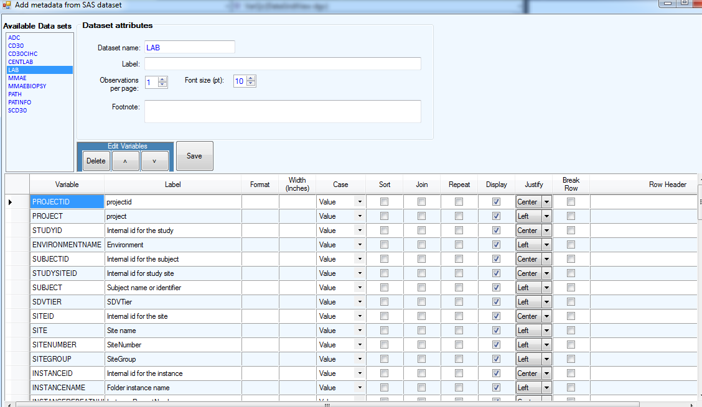

Figure 8: Add data from a SAS data set

Click the available data set to read the SAS data set metadata into the edit data form. (The functionality of the edit data form is described in `Modifying the properties of a dataset <#modifying-the-properties-of-a-dataset>`__.) Within this function you can customize the SAS data set by removing, sorting, or redefining variable attributes.

4.3.2 From the Database
~~~~~~~~~~~~~~~~~~~~~~~

If a user adds and customizes the data set metadata from outside of Rave for one study, that metadata can be used for an unrelated analysis. This is useful for derived data sets like PatInfo, which may be identical between protocols. Click “Datasets” -> “Add data from database” to bring up the form below:

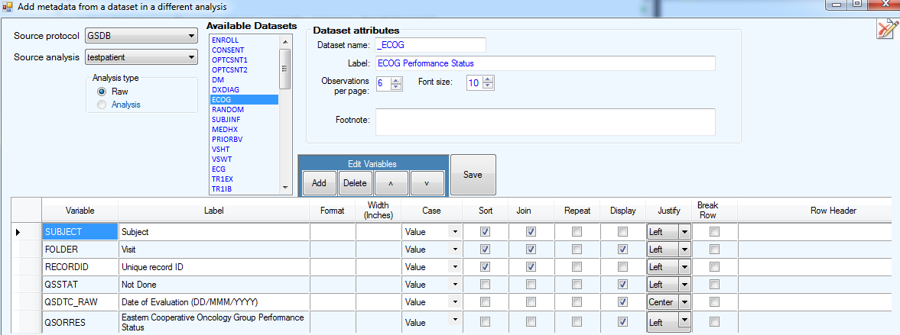

Figure 9: Add datasets from database

Select the source analysis to return a list of available data sets, then select a data set to load the metadata into the form. The actual SAS data set need not exist at this point to define the metadata, though there must be a corresponding data set in the data folder prior to report generation.

4.4 Track Changes
++++++++++++++++++++++++++

The application can be used to generate outputs that identify updates, inserts, and deletes between two corresponding SAS data sets. To enable track changes, click “Track Changes” -> “From a folder” and select a source for the comparison data from an existing folder.

Once a comparison data source is selected, the comparison data path and comparison extract date control will become visible on the form. Current data’s folder path and snapshot data shall be selected in “Data Folder” and “Current date” whereas comparison data is in “Comparison data” and “Compare date”. To disable track changes, click “Track Changes” -> “Disable”, instead of closing the application.

Comparison relies on the join variables (refer to Join function in `Section 4.2.5 <#modifying-the-properties-of-a-dataset>`__). For Rave data sets, RECORDID is generally the best variable to use as join (but not as Sort). Starting from version 3.0, there is a “Set RECORDID as join variable” option under the “Datasets” menu to allow users to set RECORDID as the top-level join variable in all the data sets selected for display. For data sets that do not have a unique key used for join comparison (e.g., database migration or some partner or legacy database which does not have RECORDID), users may depend on the attributes of each data set to select multiple join keys to make the data set keys unique. For pre-processed data sets, users need to keep join keys in there, for majority of cases like transposed lab and vital signs, having subject ID, visits, date/time and reference ID (if available) may be sufficient but users may decide by study needs. To modify the join variables, double-click the data set name. This will display the edit data form. There you can check/ uncheck to update join variables for a data set.

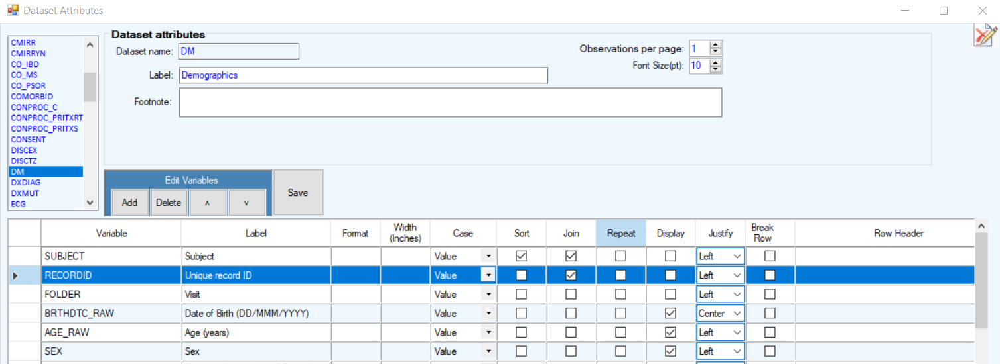

Figure 10: Use join to control key variables for each data set for track changes

To simplify the merge variable process, a configuration form becomes useable when track changes is enabled. To modify the Join (merge) variables, click “Track changes” -> “Configure” -> “Update merge variables”. This will display the form as

Figure 11, and clicking the data set will lead to edit data set attribute as Figure 8 to edit each data set.

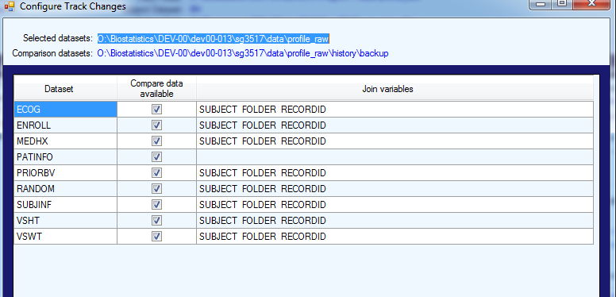

Figure 11: Use configures to control key variables for track changes

The output will identify changes in the following manner.

+---------------+------------------------------------------------------+
| Changes       | Present in output                                    |
+===============+======================================================+
| Updates       | Red strikethrough for old value, blue for new value  |
+---------------+------------------------------------------------------+
| Deletes       | Red strikethrough for the entire record              |
+---------------+------------------------------------------------------+
| Inserts       | Blue italic for the entire record                    |
+---------------+------------------------------------------------------+

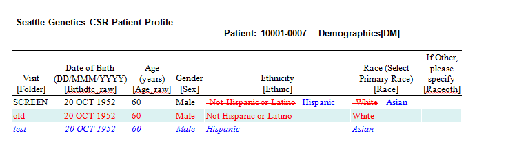

Figure 12: Example of track changes

4.5 Generate Report
++++++++++++++++++++++++++++++

4.5.1 RTF
~~~~~~~~~

To create the final Patient Profile outputs, simply click “Generate report”-> ”RTF”. The final outputs in RTF format will be automatically created in the location that users defined in “Output Path”.

4.5.2 Create SAS Program 
~~~~~~~~~~~~~~~~~~~~~~~~~

User can build SAS programs and generate patient profiles in the SAS environment directly from this tool. It is recommended when creating patient profiles for a large number of subjects. Click “Generate report” -> ”Create SAS program” -> save to the desired folder path. The program “create-profiles.sas” and batch execution file “fix-toc.bat” would be saved in the folder. The program contains macro mcr_spi_patient_profiles which defines all settings in macro parameters, as presented in Figure 11 and Figure 12.

After executing create-profiles.sas, patient profile outputs are generated without a table of contents. Double click fix-toc.bat which helps to create that table of contents. For patient profiles with track changes, a summary spreadsheet will be created instead of the html file that's generated straight from the tool.

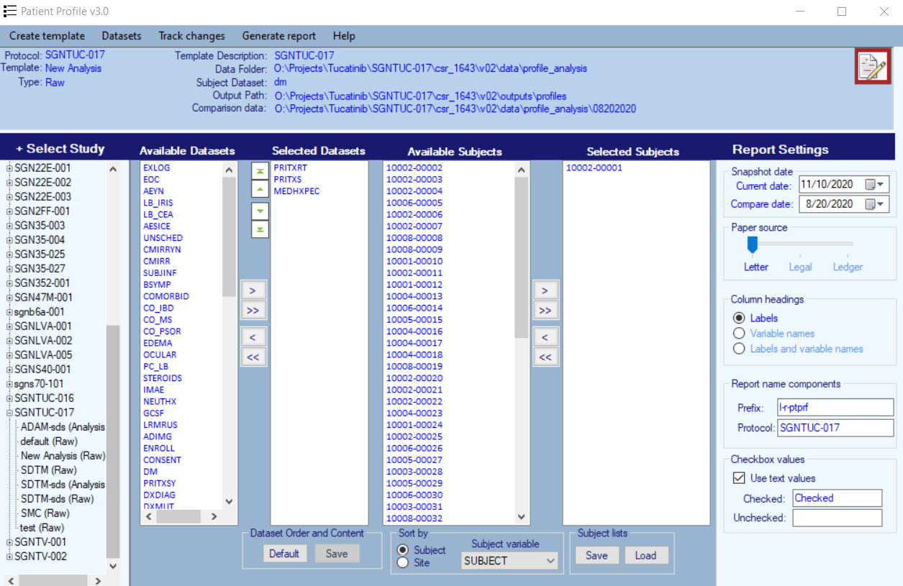

Figure 13: Selected datasets, subjects, folder and format setting in main form

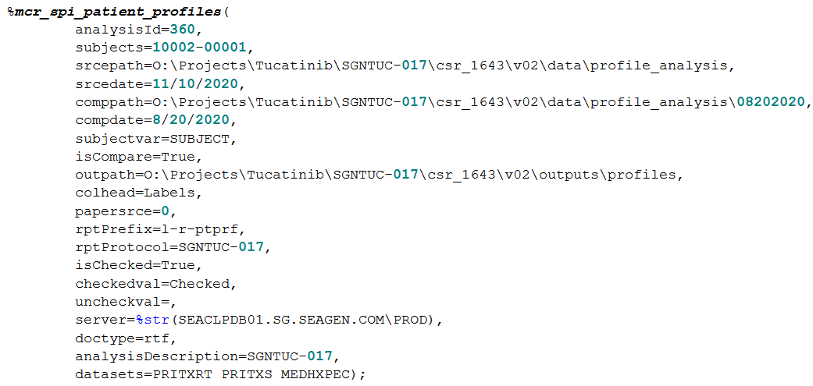

Figure 14: Generated SAS program corresponding to the settings in Figure 11

5. Document Version History
-------------------------------------

+---------+-----------+----------+--------------------------------------------------------------------------------------------------+
| Version | Date      | Author   | Description of Changes                                                                           |
+=========+===========+==========+==================================================================================================+
| 1.0     | 03-Feb-14 | shopkins | Initial release                                                                                  |
+---------+-----------+----------+--------------------------------------------------------------------------------------------------+
| 1.1     | 18-Feb-14 | shopkins |                                                                                                  |
+---------+-----------+----------+--------------------------------------------------------------------------------------------------+
| 2.0     | 15-Jul-14 | shopkins |                                                                                                  |
+---------+-----------+----------+--------------------------------------------------------------------------------------------------+
| 3.0     | 18-Dec-20 | awu      | Added new features in patient profile 3.0 and accommodate to department standard and SPI macros. |
|         |           |          |                                                                                                  |
|         |           | ygu      | 1. create output and SAS program                                                                 |
|         |           |          |                                                                                                  |
|         |           | shopkins | 2. read-in SDTM/ADaM SDS files                                                                   |
|         |           |          |                                                                                                  |
|         |           |          | 3. delete/sort multiple variables                                                                |
|         |           |          |                                                                                                  |
|         |           |          | 4. add set RECORDID as join variable option                                                      |
|         |           |          |                                                                                                  |
|         |           |          | 5. data preparation                                                                              |
+---------+-----------+----------+--------------------------------------------------------------------------------------------------+
