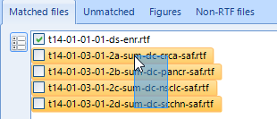

.. |excel| image:: excel.png

RTF Comparison Utility 
================================
The RTF Comparison Utility is a Windows Desktop application that automates the Microsoft Office Word applications compare functionality. The application generates a summary of 
revisions by file and allows the user to ignore revisions that contain a user-defined list of words. 
The application generates the Word merged file with the revision markup and optionally an Excel file detailing revisions of interest. 

Compare RTF Files
-----------------------
#. Use the |original| button to select the folder that contains the original versions of the RTF files for comparison by selecting any file.
#. Use the |revised| button to select the folder that contains the revised veresions of the RTF files for comparison by selecting any file.
#. By default, the location for the merged, marked-up compare files is the *compare* subfolder created by the app under the path of *Original*. To change this location 
   click the |merged| button to select a different folder.
#. Select the files to compare by checking the file name in the *Matched file" checked list box. 

    .. note:: 
        
        * The |check| button toggles the check state of all the files. 
        * You can hold the ctrl button and mouse over the files to *lasso* multiple files then use the space bar to toggle the checked state. 

        |lasso|

#. Update the default exclusion strings if desired. The application will not include any revisions that contain these strings as part of the summary. However all revisions will appear 
   mark-up in the merged document, even those excluded from the summary. To add additional string, enter the string (case-sensitive) on a new line in the text box.  Use the |restore| button to 
   return to the default exclusion strings.
#. Optionally set the *Threshold for revisions* constraint to limit the summary generation for files with a lot of revisions. 

        * Use *Total* revisions to skip the summary generation for files that exceed *n* number of revisions. 
        * Use *Avg by page* to limit revsions to the no more than *n* per page. This can be useful if you have very long listings and single page tables in the same comparison.           

   .. note:: 

        * The revision threshold includes all revisions, even those that are ignored from the summary from the exclusion strings.        
        * The revision collection created by comparing two RTF files has dynamic properties that are resource-intensive to query and can take a very long time to generate the summary. The app will always create the merged file, but for files with a lot of changes, it's best to forego the summary. 
        * If you really want a summary for a document with thousands of changes, run it alone and set the revisions appropriately. 

#. Click |run| to start the comparison of selected files. The application will update the progress bar as each file is merged and compared. 

#. Once complete, navigate to the *Revisions* grid to see the summary of file comparisons. If the *Differences dectected* checkbox is checked, then you can expand the child table to view the revisions. The 
   |open| buttons will open the merged, orginal, and revised files - only the merged file contains markup.
   
    
    .. note:: 

        |revisions|

#. Optionall click |excel| on the *Revisions* tab to export the Revision details to Excel. The |view| button will open the *compare* subfolder where the merged files are saved. 

    .. note:: 

   

        