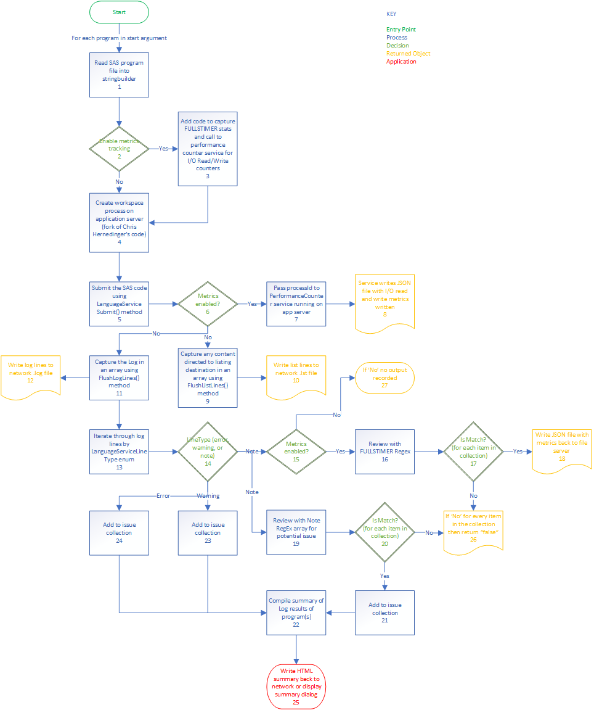

.. |git|  image:: git.png 
    :width: 20px
    :target:  https://github.com/cjdinger/SasHarness/blob/master/SasServer.cs

RunSAS System Design
===============================
RunSAS.exe is a Windows console application written in C# to facilitate the batch submission of SAS program files from the file server (SGSASFSv1) to the application servers (SGSASv1 or SGSASv1-stg). The application 
also provides automated log review, routes the log and list destination to physical files in the same folder as the submitted program, and optionally captures FULLSTIMER metrics linked to Windows 
Performance Counter (I/O Read and Write) metrics. 

The application uses SAS Integration Technologies to connect the .NET environment to a SAS workspace server process using integrated Windows authentication. Methods exposed from an 
instance of the LanguageService object provide the functionality to submit SAS code and capture the SAS log and list output. 

Users interact with the application though a context menu to submit a single program or a .bat or .cmd file to execute multiple programs. For multiple programs, the application will submit the program files in 
the order specified in the  `program list .dat file <runsas.html#submit-a-list-of-sas-programs>`_. After the code for each program completes, the application compares the SAS log results with the 
`error tolerance level <runsas.html#command-line-parameters>`_ set in the command line arguments. If the log findings are accepable per the error tolerance level, the application submits the next program in the sequence. A new workspace server 
process is created for each program to ensure the environment is free of unexpected artifacts. The application creates a summary of the SAS log(s) as either an interactive dialog or HTML file, 
depending the `run mode <runsas.html#command-line-parameters>`_. 

The diagram below describes the flow of batch program execution in RunSAS.exe. The SasServer class used to interact with the SAS system in RunSAS is a fork of Chris Hemedinger's SasServer class publicly 
available in his GitHub repo located here |git|.

Program flow diagram
-----------------------------

