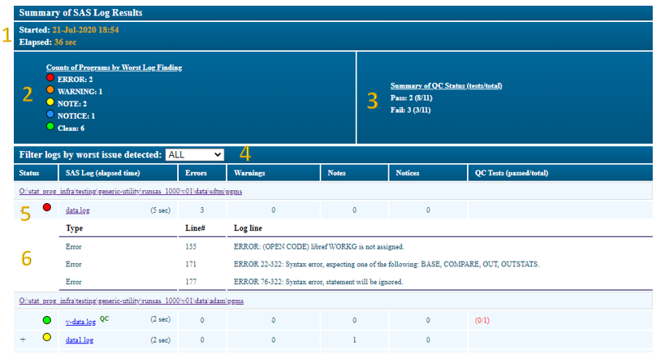

RunSAS v5
======================
RunSAS.exe is a Windows console application that facilitates the batch submission of a SAS program file on a remote server to SAS executable on a different server. It is available from the
Window context menu for SAS program and log file classes (e.g. right-click submit). It provides functionality to conditionally submit multiple programs sequentially by calling the application
from a .bat file. Table below describes the positional command-line arguments for RunSAS.exe. See `Design <design.html>`_ for more details. 

Command-line parameters
--------------------------------
Command-line arguments 0 - 4 are required and must be specified in the format demonstrated in the example calls. Argument 5-*n* are optional.

.. list-table::
  :widths: 10 60 100
  :header-rows: 1

  * - Position
    - Description
    - Valid Values
  * - 0
    - Path and name of the executable
    - Use the following paths to targe the desired application server

        * Prod:  "I:\\deploy\\stratus\\sas_batch_submit\\RunSAS.exe"
        * Stage: "I:\\deploy\\SasBatchJob-stg\\RunSAS.exe"
        * Dev:   "I:\\deploy\SasBatchJob-dev\\RunSAS.exe"

  * - 1
    - Name of the input file. May be a .DAT, .CSV, or .SAS program. Use %cd%\[file name] to reference a file in the current folder.
    - File types
                    
      .. table::

         =========================  ============================================
          Value                      Description
         =========================  ============================================
         .DAT file                   List of paths and programs, 1 per line
         .CSV file                   List of paths and programs,program type.
                                     1=Primary, 2=QC. The automated QC review
                                     only works if *mcrBinComp* is used to
                                     compare Primary and QC datasets
         .SAS files                  Name of a single SAS program to execute
         =========================  ============================================
  * - 2
    - Display mode for results of SAS program execution summary
    - Display Types

      .. table::

         =========================  ============================================
          Value                      Description
         =========================  ============================================
         Display                    An HTML file that displays any findings
                                    identified by the log reviewer is created
                                    and opened on the users PC.
         Quiet                      An HTML file that displays any findings
                                    identified by the log reviewer is created
                                    but not opened on the users PC.
         GUI                        A summary is displayed in a GUI when input
                                    file is a SAS program.
         =========================  ============================================
  * - 3
    - Path of the location of the summary HTML file
    - Valid file path.  Use *%cd%* to reference the current folder.
  * - 4
    - Error tolerance level. Indicates the action to with respect to program
      execution when an issue is detected.
    - Error Tolerance Levels

      .. table::

         =========================  ============================================
          Value                      Description
         =========================  ============================================
         QC_OFF                     The application will execute all programs
                                    listed in the input file.
         QC_NORMAL                  The application will terminate if an ERROR
                                    condition is detected in the SAS log file.
                                    Programs listed after the offending program
                                    will not be submitted.
         QC_STRICT                  The application will terminate if an ERROR
                                    or WARNING condition is detected in the SAS
                                    log file.
                                    Programs listed after the offending program
                                    will not be submitted.
         =========================  ============================================
  * - 5
    - HTML summary file name. This argument is optional, unless position 6 is used to specify macro variables, then it is required.
    - Any valid Windows file name, without path or extension. Use **"%~n0"** to refer the current .BAT file dynamically.
  * - 6 - *n*
    - One or more macro variable name:value pairs in the format "[macro variable name]:[macro variable value]". Users can declare global macro variables that will defined in
      each program submitted by the application. This replaces the functionality provided by the -SYSPARM command-line argument for SAS.exe.
      execution when an issue is detected.
    - "mvar1:This is macro variable 1" "mvar2:This is macro variable 2"

        .. warning::

            Macro variable names must comply with SAS v7 naming conventions or the application will terminate without executing any programs.

Using RunSAS
------------------
RunSAS.exe can be invoked by creating a .BAT file with the following calls. Users can create lists of SAS programs in a .DAT or .CSV file and pass that file name to 
RunSAS.exe as the position 1 argument to submit multiple SAS program files (replaces mcrSubmit). If more than one program is specified in position 1 (e.g. .BAT or .CSV file) the application 
will create a summary HTML file in the location specified in position 3. 

Below are a list of example calls for several common situations. Use the |copy| to copy the code to the buffer and paste the text into a .cmd or .bat files. Be sure to the preserve the 
formatting (e.g. leading spaces for each line after the call to the .exe)

Submit a list of SAS programs
+++++++++++++++++++++++++++++++++++++++++++++++++++++++++++++++++++++++++++++++++++++++++
This call will submit all the programs listed in pgms.dat file sequentially. The programs must have path, program name, and extension in the .dat file. 
The application will generate an HTML file summarizing any issues dectected. 

.. code-block:: python

  @echo off
  "I:\deploy\stratus\sas_batch_submit\runsas.exe" ^
   "%cd%\pgms.dat" ^
   "Display" ^
   "%cd%" ^
   "QC_Off" ^
   "%~n0"

.. raw:: html    
    
    

    <i style="color:#073642;font-weight:bold;text-alignment:center;text-decoration: underline;">The contents of pgms.dat</i> 
    <i style="font-style: normal;font-size: smaller;color: #268bd2;">O:\Projects_dev\SGN-99\RunSAS\generic_1000\v01\data\sdtm\pgms\ae.sas</i><br/ >
    <i style="font-style: normal;font-size: smaller;color: #268bd2;">O:\Projects_dev\SGN-99\RunSAS\generic_1000\v01\data\sdtm\pgms\dm.sas</i><br/ >
    

.. note:: 

   * To change the behavior of the job to terminate further program execution if an ERROR is encountered, change *QC_Off* to *QC_Normal*.
   * To change the behavior of the job to terminate further program execution if a WARNING is encounted, change *QC_Off* to *QC_Strict*
   * The .dat file can contain program files from various locations, not just a single pgms folder
  
Assign macro variables from the command line 
+++++++++++++++++++++++++++++++++++++++++++++++++++++++++++++++++++++++++++++++++++++++++++++++++++++++++
It is possible to add macro variables to the programming environment from the command line. Specify as many key:value pairs as needed after the HTML summary file parameter argument. 

.. code-block:: python

  @echo off
  "I:\deploy\stratus\sas_batch_submit\runsas.exe" ^
   "%cd%\pgms.dat" ^
   "Display" ^
   "%cd%" ^
   "QC_Off" ^
   "%~n0" ^
   "mvar1:value 1" ^
   "mvar2:value 2"

  
Automated QC status with mcrBinComp
++++++++++++++++++++++++++++++++++++++++++++++
Enable this functionality in the .dat file by adding a column after the program to indicate if the program is a primary or qc program (e.g. 1=primary, 2=QC). 
QC program *MUST* call mcrbincomp and be designated as QC program in the .dat file to enabled RunSAS to evaluate the qc status. 

Alternatively, the user can write the expected qc message directly from a custom QC step without using mcrBinComp:

.. code-block:: sas

  %if &failure_condition_is_true. %then %do;
    %put %str(NOT)E: %str(QC_)FAIL! 
  %end;
  %else %do;
    %put %str(NOT)E: %str(QC_)PASS!;
  %end;

The format of the .dat file to enable QC functionality: 

.. raw:: html    
    
    

      <i style="color:#073642;font-weight:bold;text-alignment:center;text-decoration: underline;">The contents of pgms.dat</i> 
      <i style="font-style: normal;font-size: smaller;color: #268bd2;">O:\Projects_dev\SGN-99\RunSAS\generic_1000\v01\data\sdtm\pgms\ae.sa,1</i><br/ >
      <i style="font-style: normal;font-size: smaller;color: #268bd2;">O:\Projects_dev\SGN-99\RunSAS\generic_1000\v01\data\sdtm\pgms\v-ae.sas,2</i><br/ >
    

Summary Log
+++++++++++++++++++++++++++++++++
The application will generate an HTML summary when a list of programs is passed to RunSAS. The elements of the summary file are described below.

#. Program start time and total SAS processing time.
#. The count of programs by the most serious error detected. A program is only counted once.
#. Counts of the total number programs with passed/failed automated QC as described above. The (tests/total) represent the total number of 
   tests (e.g. calls to mcrBinComp) that passed or failed for all the programs included in the run. A single can have more than one test.
#. Filter for log files by the most serious error detected in the log. 
#. Summary of the SAS log file with counts of the total number of issues detected by type
#. Expandable table of each issue detected in the SAS log

Types of Errors
+++++++++++++++++++++++++++++++++++++++
The applications uses the `SAS log line type enum <https://support.sas.com/rnd/itech/doc/dist-obj/comdoc/ilngca.html#ilngIfaceLineType>`__ in combination with a series of regular expressions 
to identify potential issues in the SAS log. 

.. list-table::
  :widths: 10 10 100
  :header-rows: 1

  * - Line type
    - Issue classification
    - Regular expression
  * - LineTypeError
    - Error
    - `^ERROR(:|.*:)`
  * - LineTypeWarning
    - Warning
    - `^WARNING(:|.*:)(?!.*Unable to copy)(?!.*scheduled to expire)`
  * - LineTypeNote
    - Note
    - (UNINITIALIZED|REPEATS OF BY VALUES|W.D FORMAT|ASSUMING THE SYMBOL|VALUES HAVE BEEN CONVERTED TO|MISSING VALUES WERE GENERATED AS A RESULT|DIVISION BY ZERO DETECTED DURING|OUTSIDE THE AXIS RANGE|INVALID ARGUMENT TO FUNCTION|MATHEMATICAL OPERATIONS COULD NOT BE PERFORMED|INVALID DATA|MEANING OF AN IDENTIFIER)/i

SPI Metrics and Logging
------------------------------------------
Optional functionality in RunSAS can be enable to troubleshoot the system or support dependent applications. This is managed by SPI.

SPI Autocall Macro Usage Statistics 
++++++++++++++++++++++++++++++++++++++++++++++++++
If the *isLogging* flag is set to true int the configuration file the application captures SPI autocall macro usage metrics. See `Design <macro_usage.html>`_ for more details.

The data can be read from the table using a libname statement 

.. code-block:: sas

  libname met odbc noprompt="DRIVER=SQL Server;
  SERVER=SEACLPDB01D.DEVSG.SEAGEN.COM\DEV,25000;
  DATABASE=MacroUsage;" 
  SCHEMA=DBO access=readonly;

  data macros;
    set met.Usage;
  run;
  
  Run-time Statistics Logging  
++++++++++++++++++++++++++++++++++++++++++++++++++
If the *isMetrics* flag is set to true in the configuration file, the application will write the sum of the FULLSTIMER options to a database for every program submitted through RunSAS. 

The data can be read from the table using a libname statement 

.. code-block:: sas 

  libname met odbc noprompt="DRIVER=SQL Server;
  SERVER=SEACLPDB01D.DEVSG.SEAGEN.COM\DEV,25000;
  DATABASE=MacroUsage;" 
  SCHEMA=DBO access=readonly;

  data metrics;
    set met.Metrics;
  run;

Peformance Counters 
+++++++++++++++++++++++++++++++++++++++++++++++
If the *isPerformanceCounter* flag is set to true in the configuration file, RunSAS will call the Windows Performance Counters API immediately prior to the release of the SAS Workspace process and 
write a JSON file to capture the specified metrics for that program. 