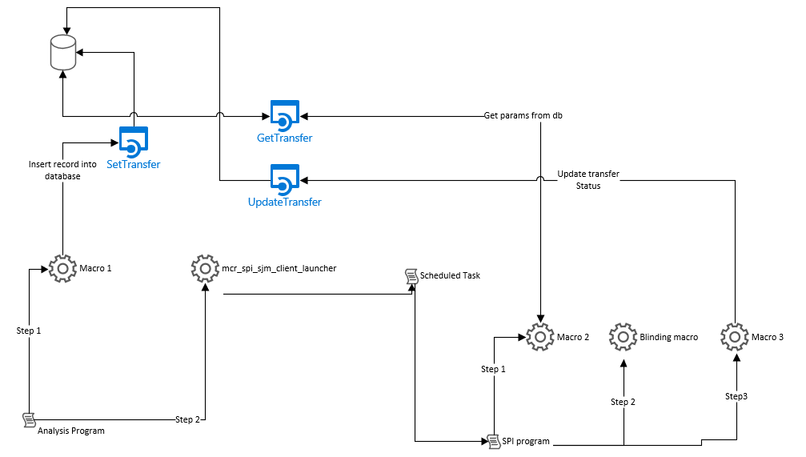

.. include:: nav.rst

SAS Dataset Blinding API 
========================================    
This API exposes three endpoints to allow programmers to pass arguments to programs across study, infrastructure, and SJM environments without 
compromising the department security model. Users interact with the API through a suite of SPI macros. The macros call the API endpoints in sequence which pass 
arguments to SAS programs separated by security boundaries. 

.. toctree:: 
   :maxdepth: 3

   set
   get
   update

Data Flow
------------------------------------------  
