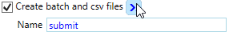

.. include:: nav.rst

Options
========================================
Table below describes the functionality available in the CLI (.bat) and GUI (SAS Launcher). To specify and option in the .bat file, pass the value of the option after the 
command line flag. In the GUI the option is specified through the interface. Most options are available in both, but some are confined to just the CLI or GUI. The 'App available' 
column in the following table lists which app support each element of functionality.

Select Server and Server Context
--------------------------------------
Seagen's SAS environment exposes two SAS application servers available to run SAS code. Users can select a specific server to run programs, or allow the app to make the 
determination (e.g. best) about which server to use. 

Best: current server with most available compute resources
++++++++++++++++++++++++++++++++++++++++++++++++++++++++++++
'Best' server allow the application to determine which server to submit jobs on based on the CPU availability. Prod is given a bias constant in the selection algorithm 
as under similar utilization, it will be faster. In parallel mode, the app will re-evaluate the best server after each batch of programs complete. In sequential mode, the app 
re-evaluates best server after each program. 

There is a time cost to evalute best with each iteration. For small jobs, selecting a specific server might be ideal. Since the CPU utilization can vary by the second, 
large jobs can benefit from determining the best server between batchs or programs, depending on run mode.

Production(prod): SGSASV1.sg.seagen.com
+++++++++++++++++++++++++++++++++++++++++++
In ideal conditions prod is significantly more performant than stage as it has more cores, RAM, and less I/O(eg. read/write disc operations) time. 

    * 8 CPU cores
    * 200GB RAM 
    * Locally-mounted file server SGSASV1, which hosts the I, O, and U drive aliases

Stage:  SGSASV1-stg.sg.seagen.com
+++++++++++++++++++++++++++++++++++++++++++
In ideal conditions prod is significantly more performant than stage as it has more cores, RAM, and less I/O(eg. read/write disc operations) time. When choosing the 'best' 
server, the application weights prod with a bias constant based on these specifications. 

    * 6 CPU cores
    * 200GB RAM 
    * Networked connection to file server (slower I/O operations than produciton)

Server Context
+++++++++++++++++++++++++
Each server has two server contexts available. Unless UTF-8 support is required, SASApp94 should be used. For Simplified Chinese data, select the SASAppUTF98 context.     

Select Run Mode
------------------------
The app supports two method for jobs submission: parallel and sequential.

Parallel
++++++++++++++++++
The programs specified for the run are submitted in batches based on available CPU. The app queries the amount of CPU available and calculates the 
maximum number of programs that can be submitted in parallel. The programs execute asynchronously while the app waits for all the programs in the batch to complete. 
Once a batch completes, the app optionally determines the best server(if best is specified for server), queries available CPU, recalculates batch size, and submits 
that number of programs in parallel. This cycle continues until all programs have been executed. The order of execution cannot be enforced, so programs with 
dependencies on other programs should not be run in this fashion.

.. warning:: 

    It's the responsibility of the user to ensure that programs with dependencies on other programs or that lock a resource used by other programs are not submitted in 
    parallel. You will get an error if a program attemps to access a resource that is exclusively locked by another program.

Sequential
+++++++++++++++++++
Programs are submitted in the order they are either specified from top to bottom either the UI grid, or listed in the CSV file. The app waits for each program to complete before 
submitting the next program in the sequence. Once a program completes, the app optionally identifies the best server and submits the next program in the sequence. Use sequential 
processing for programs that create dependencies other program require. 

.. note:: 

    Launching programs via right-click does not support sequential processing. 

Default options
-----------------------
The app allows the user to alter the default behavior of several boolean 

Review Logs
++++++++++++++++++++++++
 By default, the app scans the logs for occurences of `possible issues <logissues.html>`__ and generates an HTML file summarizing the findings for all the logs. If run interactively,
 the summary is written to the 'run_summaries' subfolder. The user can direct the location of the summary file in the .bat file using the -h flag. 

Record Macros
++++++++++++++++++++++++++
By default, the app identifies all the department-level macros compiled in the SAS environment during program execution. AIM uses these records to determine re-test status 
if a dependent macro was modified after the output was validated. 

Notify on Completion
+++++++++++++++++++++++++++
The app can optionally send an email notification with a brief summary of log findings for each program in a job. If the app is run interactively, the notification is sent to 
the current user. In the .bat file, a list of recipients can be optionally specified in the -u flag. 

Resolve SAS Code (Beta)
+++++++++++++++++++++++++
The app can optionally generate a corresponding single, stand-alone .sas program file, free of external macro dependencies, for each program included in a job. The app creates the 
raw, resolved code SAS program file in the 'resolved' subfolder. The app also creates another version, formatted for presentation, in the 'formatted' subfolder under resolved. This 
functionality will evolve over time as new patterns that didn't resolve or format correctly are brought to SPI and corrected. 
This resulting program files can be shared externally as runnable programs without the need to provide Seagen's macro library. Data file dependencies will need to be included as 
they will not become part of the code. 

.. warning::

    Expect long run times using this feature as requires SAS options to be in place that cause very long I/O times.

Create batch and .CSV files
+++++++++++++++++++++++++++++++
The app can optionally generate a .bat and .csv files based on the selections made in the SAS launcher UI. Use the Create Batch file button to generate a .BAT and .CSV file without 
submitting the programs. Alternatively, check the box and provide and name for the .BAT and .CSV files, and submit the programs. The files are generated on completion of the job.

