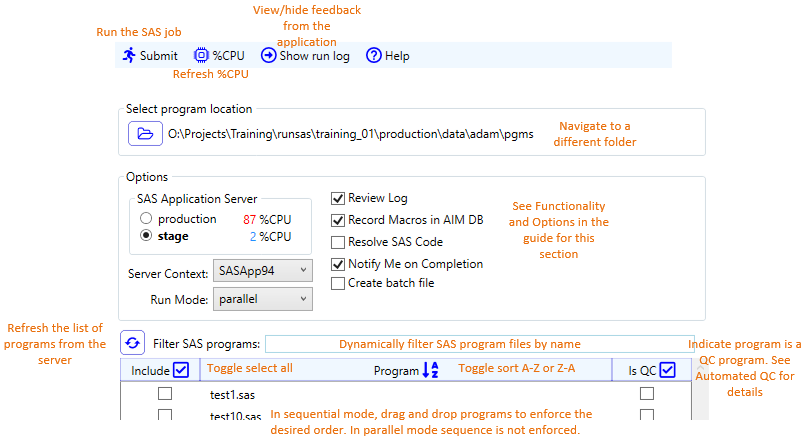

.. include:: nav.rst

RunSAS Client Interfaces
============================
RunSAS can be invoked directly by the user from either a a command line interface(CLI) via a.bat file or the a context menu, or by through SAS launcher grahic user
interface(GUI) application. Both methods call the same 
executable and can access similar options, though the context menu has a default set of options defined by SPI.

Command Line Interfaces 
-----------------------------------
Windows .BAT File CLI
+++++++++++++++++++++++++++++++++++
Using a .bat file to call the RunSAS application allows the user to have complete control over all the options without needing to invoke the UI. The parser for
command line interface accepts options defined in the [options] table. .BAT files, and the corresponding CSV file can be generated from the SAS Launcher. The app uses the 
selections in the GUI to create an identical .BAT file and a CSV file of the same name containing the selected programs. `Examples <bat.html>`__

Context Menu ('Right-Click') CLI
++++++++++++++++++++++++++++++++++++++++++++++++
[coming soon]

SAS Launcher GUI
--------------------------------------------------
The SAS launcher is invoked by optionally selecting one or more SAS files or just with the cursor focused in a directory that contains SAS files, 
and selecting **SAS Launcher** from the right-click context menu. The app will automatically determine and display the CPU utilization for each available server and select the 
best server using a bias algorithm. 

Functionality and Options
-------------------------------------------------
Table below describes the functionality available in the CLI (.bat) and GUI (SAS Launcher). To specify and option in the .bat file, pass the value of the option after the 
command line flag. In the GUI the option is specified through the interface. Most options are available in both, but some are confined to just the CLI or GUI. The 'App available' 
column in the following table lists which app support each element of functionality.

.. list-table::
    :widths: 5 5 5 50 40 5
    :header-rows: 1

    * - Option 
      - App available
      - CLI Flag
      - Description
      - Arguments (Default value in **Bold**)
      - Required
    * - Run Mode
      - CLI & GUI
      - -a	
      - Boolean that indicates if the programs are submitted sequentially(e.g. program completes before next program starts), or in parallel (e.g. programs 
        are submitted in batches based on server availability)        
      -  
        .. list-table:: 
           :widths: 10 30
           :header-rows: 1
                        
           * - Value
             - Description
           * - **true** 
             - The programs specified for the run are submitted in batches based on CPU utilization. The app queries the amount of CPU available and calculates the 
               maximum number of programs that can be submitted in parallel. The programs execute asynchronously while the app waits for all the programs in the batch to complete. 
               Once a batch completes, the app queries available CPU, recalculates batch size, and submits that number of programs in parallel. This cycle continues until all 
               programs have been executed. The order of execution cannot be enforced, so programs with dependencies on other programs should not be run in this fashion.
           * - false 
             - Programs are submitted in the order they are either specified in -p argument, or listed in the -c CSV file. The app waits for each program to complete before 
               submitting the next program in the sequence.
      - no
    * - Select best server
      - CLI & GUI
      - b	
      - Boolean that indicates app chooses server based on CPU availability. There is a small cost in time as the app has to first query each server to get CPU utilization 
        via a REST API. The GUI always suggests the best server during startup. 
      -
        .. list-table:: 
           :widths: 10 30
           :header-rows: 1
                        
           * - Value
             - Description
           * - **true** 
             - compares CPU availability and selects the best server based on selection algorithm
           * - false 
             - uses the server specified in -s parameter, or takes the default server defined in app.config
      - no
    * - CSV 
      - CLI
      - -c	
      - File name of a CSV file that identifies the list of SAS programs to execute
      - CSV file with records in the format <full path to SAS program file>,{1|2} (See `Automated QC <qc.html>`__ for more details on using the CSV file)
      - Required if -p is not specified
    * - Is Interactive
      - CLI 
      - -i	
      - Boolean that indicates app opens the HTML log summary interactively in a browser upon completion. The GUI defaults to interactive.
      -  
        .. list-table:: 
           :widths: 10 30
           :header-rows: 1
                        
           * - Value
             - Description
           * - **true** 
             - opens the log summary in default browser
           * - false 
             - does not open the log file. Use for automation or unmonitored runs
      - no    
    * - Review logs
      - CLI & GUI    
      - -l	
      - Boolean that indicates if post-processing (e.g. log review) is performed after program are executed.
      -  
        .. list-table:: 
           :widths: 10 30
           :header-rows: 1
                        
           * - Value
             - Description
           * - **true** 
             - Scans the logs for occurences of `possible issues <logissues.html>`__ and generates an HTML file summarizing the findings in the run_summary subfolder
           * - false 
             - Do not review logs. SLP assumes responsiblity for compliance with program review guidelines. 
      - no                 
    * - Record macros
      - CLI & GUI    
      - -m	
      - Boolean that indicates if app records the collects department macros compiled in the SAS environment and writes the records to a database for use in AIM status assignment
      -  
        .. list-table:: 
           :widths: 10 30
           :header-rows: 1
                        
           * - Value
             - Description
           * - **true** 
             - captures and records department macros compiled during execution
           * - false 
             - Does not capture macros. This is intended for programs not recorded in the Analysis Index file or for special cases determined by SLP.
      - no   
    * - Notify on completion
      - CLI & GUI    
      - -n	
      - Boolean that indicates if user is notified via email at the completion of the job. The GUI only sends the notification to the current user.
      -
        .. list-table:: 
           :widths: 10 30
           :header-rows: 1
                        
           * - Value
             - Description
           * - true
             - Sends an email message with a run summary to the recipients specfied in -u, or the current user if -u is not specified
           * - **false** 
             - Does not send an email message
      - no  
    * - Only review logs
      - CLI    
      - -o	
      - Boolean that indicates if the application reviews the SAS log files specified in -p. This parmeter is only if the user is passing SAS logs, not programs, using 
        the -p flag. This option reviews and summarizes existing SAS logs; it does not submit programs. 
      -
        .. list-table:: 
           :widths: 10 30
           :header-rows: 1
                        
           * - Value
             - Description
           * - true
             - Reviews and summarizes the log files specified in -p and generates the HTML summary file. (Does not calculate pass/fail for QC programs)
           * - **false** 
             - Treats files specified in -p or -c as SAS programs 
      - no 
    * - Programs
      - CLI & GUI    
      - -p	
      - Space-delimited list of SAS programs. Spaces in the paths are not supported for this parameter.If path do have spaces, use -c to specify programs in CSV file. 
      - Fully qualified list of SAS program files delimited by a spaces
      - Required if -c is not specified.    
    * - Resolve SAS Code
      - CLI & GUI    
      - -r	
      - Boolean that indicates if SAS program code is resolved (e.g. no external dependencies or macros) in a corresponding program in 'resolved' subdirectory. 
        Used to deliver runnable programs to an external recipient without providing infrastructure
      -
        .. list-table:: 
           :widths: 10 30
           :header-rows: 1
                        
           * - Value
             - Description
           * - true
             - Creates a corresponding program with resolved code in the 'resolved' subdirectory.
           * - **false** 
             - Does not resolve program code.
      - no 
    * - SAS application server
      - CLI & GUI    
      - -s
      - Name of server hosting the SAS workspace that will execute the program code. If not specified, the app will either use the default server 
        defined in the app.config, or if -b is True, the app will determine the best server to use.
      -
        .. list-table:: 
           :widths: 10 30
           :header-rows: 1
                        
           * - Value
             - Description
           * - sgsasv1.sg.seagen.com
             - Production server. More performant server when not CPU bound, with locally mounted file share (O: drive)
           * - sgsasv1-stg.sg.seagen.com
             - Stage server. Secondary production server that can be used when production is slow or down.        
      - no              
    * - Notification recipients 
      - CLI
      - -u
      - Space-delimited list of user accounts to recieve email notifications if -n true. 
      -
        .. list-table:: 
           :widths: 10 30
           :header-rows: 1
                        
           * - Value
             - Description
           * - **[blank]**
             - The current user. This is the default for both the GUI and CLI. 
           * - space-delimited list of accounts. 
             - Example: -u shopkins atella mness    
      - no     
    * - Server context
      - CLI & GUI    
      - -x
      - Name of the application server context to use to create the workspace
      -
        .. list-table:: 
           :widths: 10 30
           :header-rows: 1
                        
           * - Value
             - Description
           * - **SASApp94**
             - Single-byte, WLATIN1 host encoding. 
           * - SASAppUTF8
             - Multi-byte, UTF-8 host encoding and support for Simplified Chinese character set.      
      - no            

