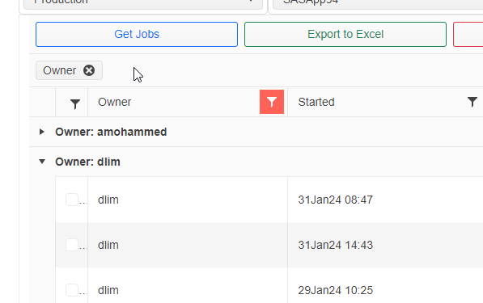

.. include:: nav.rst

SAS Process Manager
=========================
The SAS Process Manager(SPM) is a .NET web application that lists the SAS Workspace servers(jobs) spawned on the selected host/server. Users can view a list jobs and terminate 
a job they spawned or export a list of jobs to Excel. 

List the Current Connections to Workspace Server
-----------------------------------------------------
#. `Open the web application <https://sgcpapp1:7011/apps/sasprocmgr/index.html#>`__
#. Select the Host Machine the SAS job was initiated on or select All Hosts to include connections from all servers.
#. Select the Server. SASAppUTF8 is only used to accesses double-byte character data. All Servers includes jobs on all server contexts. 
#. Click |run| to get a the list of current jobs on the selected host(s) / server(s)
#. Click |kill| to terminate a job you own. 

.. note::
   
   Members of SPI have priviliges to terminate any job. Users can only terminate jobs they have spawned. 

Unlocking a Locked dataset
-----------------------------------
The `Open File Assistant(OFA) <https://sgcpapp1:7011/apps/openfileassistant/openfileassistant.html>`__ can be used to identify which user has a dataset open. OFA can 
close the connection to the dataset in the client application (EG, SAS Viewer, SJM) but it cannot kill the workspace server session actively connected to the dataset. 
This is where SPM can be used to terminate processes opened by the user to remove the lock on the dataset without requiring IT support. If the user that spawned the job 
is unavailable, any member of SPI can terminate any job. 

Job Attributes Displayed in the UI
----------------------------------------
The following are properties users can use to identify a session that has been orphaned by a client application or SJM scheduler. Users can terminate jobs that they 
spawned. Attributes like program name or dataset are not exposed through the workspace server instance thus cannot be displayed.  

.. list-table:: 
  :widths: 20 80
  :header-rows: 1

  * - Column
    - Description
  * - Host
    - Name of the SAS VM hosting the SAS Workspace Server
  * - Server
    - Name of the SAS Server context. SASApp94 for single-byte (WLATIN1 encoding), SASAppUTF8 for multi-byte (UTF-8)  
  * - Owner
    - Account name of the user that spawned the job
  * - Started
    - The Date/time the job was initially spawned. For EG, this is the time that the instance the workspace server was created, the first line of code executed for example, notwhen the client app was opened. 
  * - Current Memory
    - The amount of memory in megabytes associated with the job at the time the app retrieved the data. For EG sessions, this can be zero if no code was executing at the time of the query.
  * - Idle Time
    - The amount of time (floor) in minutes where a workspace server session uses 0 memory. 
  * - Process Id
    - Integer assigned by the host OS to uniquely identify the process. 
  * - Server Id 
    - String assigned by SAS that uniquely identifies the workspace server spawned by the user. Used to terminate the process. 

UI Features
----------------------
The UI supports filtering on each column using a comprehensive filter control. To instantiate a filter, click the |filter| button next to the column, provide the 
filter type and arguments, and apply the filter. The |active| filter icon means a filter is applied. Clear the filter by opening the filter and clicking |clear| 

Each header can be used to toggle A-Z sorting by clicking the header cell, and group records by column. To group records by column, drag column heading into the 
'Drag a column header and drop it here to group by that column' container above the headers. To ungroup, click the x in the column entry in the 'Drag a column..' cell

