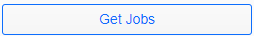

`Home <index.html>`__ |  

.. |close| image:: close.png  

.. raw:: html 

    <embed>
        <link rel='stylesheet' href='https://stackpath.bootstrapcdn.com/bootstrap/4.2.1/css/bootstrap.min.css' integrity='sha384-GJzZqFGwb1QTTN6wy59ffF1BuGJpLSa9DkKMp0DgiMDm4iYMj70gZWKYbI706tWS' crossorigin='anonymous'>
        
        
        
         
         
         
    </embed>