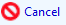
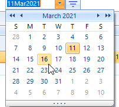
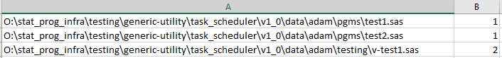
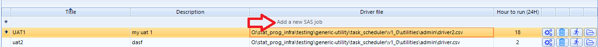
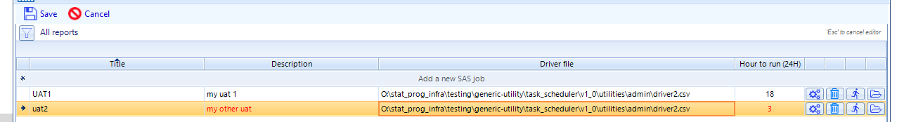

.. |save| image:: save.png

.. |cfg| image:: configure.png

Job-level details and Driver file
====================================

.. include:: nav.rst

The highest level of the hierarchy of the configuration of a SAS job is the job-level details. This includes the following attributes

.. list-table::
  :widths: 30 70
  :header-rows: 1

  * - Attribute
    - Description
  * - Title 
    - The title of the job is used for identification. The title will also be a component in the name of the log summary file. The value of 
      title must be a valid Windows file name
  * - Description
    - Short description of the job 
  * - Driver file
    - CSV file that lists the path\\program.sas for each SAS program file and it's type
  * - Hour to run
    - Integer that corresponds to the 24h hour component of the time that the automation will execute. Valid values are 1-23.  

The Driver file
-----------------------     
The content of each SAS job is defined by a CSV driver file. The path\file of the driver file must be unique for each SAS job defined in the scheduler. For consistency, 
save the driver files at the [protocol-level]\\utilities\\admin folder. Avoid storing these files at the production level as production folders will eventually be 
locked in most cases. You can have a driver file for each production folder that requires automated jobs or a single driver file that calls programs in multiple locations

 The driver file
consists of two columns 

* [path\program name]
* Program type  1=Production, 2=QC program

.. note:: 

    A QC program is a program that calls mcrBinComp to perform comparisons between datasets. Alternatively, the user can create their own QC algorithm, but 
    the return values and log notifications must match those of `mcrBinComp <http://sgcpapp1/cp/macros/mcrbincomp/mcrbincomp.html>`__. If program does not call 
    mcrBinComp or a custom utility that implements mcrBinComp's behaviors, then it is not a QC program from an automation perspective. Designating a program 
    as a QC program in the driver file when that program does not implement the required behavior will result in the QC status assigned *Fail* in the run summary. 

Example driver file: 
--------------------------

Entering a new SAS Job
----------------------------------
The create a new job Click in the Title column of the top row with the message 'Add a new SAS job' displayed. 

The text box is enabled and enters edit mode. Enter the value and Tab to the next field. Both Title and Description are required. Tab to the drop-down menu for 
driver file and select a unique driver CSV file. Tab into the hour to run and type or use the spin control to select the 24hr time to schedule the job. Tab out of 
the last field to save the record. You do not have to click Save when entering a new record as they are validated and saved when the row loses focus. Use the *ESC* key to 
abort the entry before it is saved.

Editing an existing SAS Job
---------------------------------
To edit and existing SAS job, double-click in the field to be modified and the record will highlight. The modified fields will change to red font and |save| button is enabled. 
Click |save| to commit the change or |cancel| to revert.

Controls
--------------
Controls on SAS Job screen of the scheduler application

.. list-table::
  :widths: 30 70
  :header-rows: 1

  * - Button
    - Function 
  * - |cfg|
    - Exposes the scheduling and notification menus to allow user to schedule the automation and configure one or more notifications
  * - |del|
    - Deletes a SAS Job and it's associated run log history
  * - |run|
    - Runs the SAS Job on demand as the current user. To use run on demand, the app must be invoked from the SAS VM as laptop does not support SMTP relay.   
  * - |open| 
    - Open the Driver file folder in File Explorer
  * - |filter| 
    - Filters the SAS Jobs by the jobs scheduled for execution on the selected date. Click the |filter| a second time to discard the filter
  * - |apply| 
    - Visible when |filter| is enabled. Applies the jobs scheduled for execution filter using the selected date
  * - |date|
    - Visible when |filter| is enabled. Select a date to see what SAS jobs will execute on a specific date.
