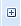
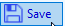
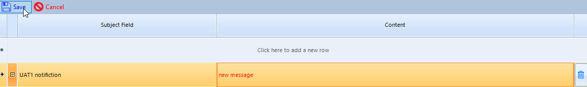
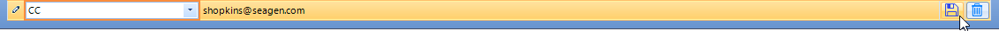

Automation Notifications and SAS Summary
====================================================

.. include:: nav.rst

The notification view allow users to create one or more notifications that are sent to the list of specified users. 

Create a new email notification 
----------------------------------------
#. Click in the Subject field in the top row to enable entry. 
#. Tab to the content field. This field is an optional field that will be embedded in the notification message to be used at the discretion of the user.
#. Tab out of the Content field and the entry will be automatically validated and saved
#. Click |expand| in the row header to expand the child grid 
#. Select either To, CC, or BCC for email type
#. Tab into the Email address column and enter a valid email.
#. Tab out of the Email address column to validate and save the new entry

Update an existing email notification 
-----------------------------------------
To update the and existing message, enter the field to update and perform the update. Click the |save| button at the top of the email form to save the changes.

To update and existing recipient, enter the field to update and perform the update. Click the |save| button on the same row of of the recipient to save the changes

Notification message
--------------------------
The notification message is sent to all the recipients defined in the notification. The message itself consists of the 

* Subject - [Job name] [started date/time] [most severe log finding detected in all the programs]
* Link to the SAS summary. 
* Any message defined in the Content field in the email
* A list of any issues encountered during the execution of the automation (outside of the SAS logs)
