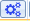
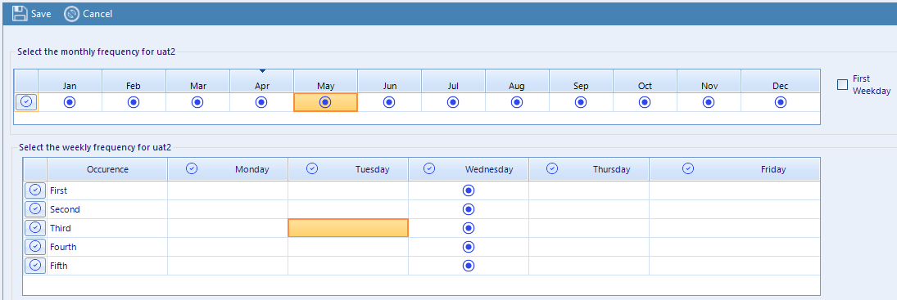

Automation Scheduler
=============================

.. include:: nav.rst

Launch the scheduler app from the shortcut I:\\apps_stratus\\SAS Job Scheduler. 

Click the |configure| button to bring up the schedule interface. This screen allows the user to select the nth days and nth weeks to run a SAS Job. 
Jobs are scheduled by occurrence rather than calendar date. The app will handle cases when there is no 5th occurrence of a day for a particular month.

#. Double-click in a month to select a month to schedule automation or use the |click| in the row header to select every month.
#. Double-click in a week x day grid to select a week x day to schedule automation, or use the |click| in the column and row 
   headers to select weeks and days in aggregate.
#. Click the |save| button to on the Schedule form save the schedule
#. Click the |return| button to return to the main menu

Example
----------
SAS job scheduled to run on every Wednesday

