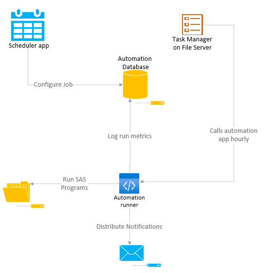

SAS Program Scheduler 
=================================================

.. include:: nav.rst

The SAS Job Scheduler provides an interface to schedule the automated execution of SAS programs. The user can configure the programs to include, the frequency of execution, 
and identify recipients to notify of the status of job execution. 

Launch the scheduler app from the shortcut I:\\apps_stratus\\SAS Job Scheduler.

    #. `SAS job-level details and driver file <driver.html>`__ 
    #. `Set the schedule <schedule.html>`__ 
    #. `Configure job notification <notification.html>`__ 
    #. `The run log <log.html>`__

SAS Job Scheduler Architecture 
------------------------------------------
#. User configures the SAS Job via the Scheduler app
#. Every hour the Window Task service calls the automation runner
#. The automation runner determines if any jobs are scheduled for the current day/time and if so, submits the job using a service account with elevated permission
#. The results of the SAS logs are reviewed and the automation runner updates the RunLog table in the automation database

