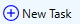
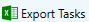
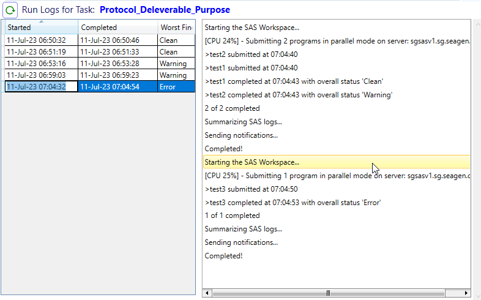

.. include:: nav.rst

SJM Scheduler UI
=========================
The UI provides functionality for users to create, update, or delete a scheduled task. The UI also display a run log that details each time the job was successfully executed. 

Users can export a matrix of tasks by time to their downloads folder using the |export| button. This can be helpful to choose a less busy time to schedule a task. 

Create a New Scheduled Task
----------------------------------
#. Click the |new| button to display the Create new task menu. 
#. Enter a description in the format Protocol Identifier_Deliverable_Purpose. Example: SGNXX-001_CSR_Raw data refresh. While this isn't enforced as some elements might note
   be applicable, it will make the task easier to find.
#. Select the SJM batch file. For jobs that access special security(SS) folders, the batch file must exist under the folder where the security is applied and the 
   user must be a member of the AD group that provides access. For default security(DS) jobs, the file can reside at any level in the folder hierarchy and be created by any member of SP.

    .. note::

      For batch files that access restricted folders, the special AD group must have the appropriate level of access to all the custom security folders referenced by the SAS programs
      (excluding DS folders). For example, if a group accesses a more restricted SS folder, and writes to less restricted SS folder, the group 
      needs to be applied to both folders through CS-096 request. Contact SPI if you have questions about cases involving more than one level of SS folders within a single job.

#. Click the |save| button to add save the task. This adds the job to the database and displays the scheduling details for the job. The |cancel| button discards a new task prior to saving.
#. Once |save| is clicked, the schedule details appear in the right pane. Select the day(s) of the week for the job to execute, and select the hour (0-23) to execute the program.
#. If this is a one-time job, uncheck 'Recurring?'. This will cause the job to execute once, then automatically disable. To run the job again, enable the job within 7 days prior to scheduled 
   execution. 
#. Once the changes are made, the |changes| indicator is displayed in the upper right. Click |save| in the upper right corner to save the scheduling details. The |cancel| button in the 
   upper right will discard unsaved changes.

.. note:: 

    You can select a job in the left pane and edit scheduling details at any time. Be sure to disable (uncheck 'Enabled?') or delete jobs that are not active to preserve bandwith. 

Run Logs
--------------------
Each time a job is successfully launched, an entry is recorded in the Run Log, and is accessible by selecting the job in the left pane. The application records the start and end times 
for the job, and the worst SAS error condition encountered during the entire job execution. Click a run log to view the SJM application notifications generated during execution.

