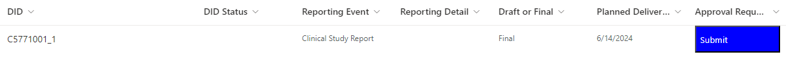

.. include:: nav.rst

Create a Deliverable
===============================
Once the study exists, the L-SLP creates an entry for each planned deliverable. 

Naming Conventions
--------------------------------------
The DID name must match the protocol name with an incremental integer representing 
each deliverable. For the first deliverable for study PFE1234, the DID entry is PFE1234_1. For each new deliverable, increment the suffix by one. The 
second deliverable would be PFE1234_2. 

Timelines
----------------------------
Only deliverables planned within 1 year are captured in DID, but if there are interim deliverables for that analysis, then use DID to track those. The most common example is 
CSR. If the CSR delivery of TLFs and datasets is > 1 year, but the study team will be delivering SDTM or ADaM prior to that, record the deliverable for the CSR, but select 
the delivery content to match the scope of the outputs (e.g. Only SDTM, Only ADaM, Only TLFs).

If the deliverable is > 90 days out, but programmers will be actively working on the deliverable and tracking the work in the daily survey, request an exception for the 
resource use beyond 90 days prior to planned delivery. See `How to request exception to start hands-on gt 90 days.mp4 <https://pfizer.sharepoint.com/:v:/r/sites/SPAaccelerator/Repository/Pfizer_vendors/07 How to request exception to start hands-on gt 90 days.mp4?csf=1&web=1&e=VOOx80>`__

Steps to Create a Deliverable in DID
----------------------------------------------
#. From the `Studies/Assets Page <https://pfizer.sharepoint.com/sites/SDSADIDManagement/Lists/DID_0/DID_0.aspx>`__ , click the *DID_N* link to bring up the Deliverables page.
#. Click the |new| icon to create a new Deliverable.
#. Select the study from the dropdown. 
#. Select the Reporting Event that most closely aligns with the L-Seagen deliverable.. 
#. Select the planned deliverable date
#. Set delivery content as applicable.

    .. image:: deliverable.png
    
#. Click |save| to create the deliverable. 
#. You will see the study has a Submit button in the grid view of the study deliverables page. Prior to submitting the approval request, follow the steps 
   to `upload LoT <lot.html#upload-the-lot-to-did-repository>`__. Once uploaded, then return back to DID_0 to click the Submit button. 

