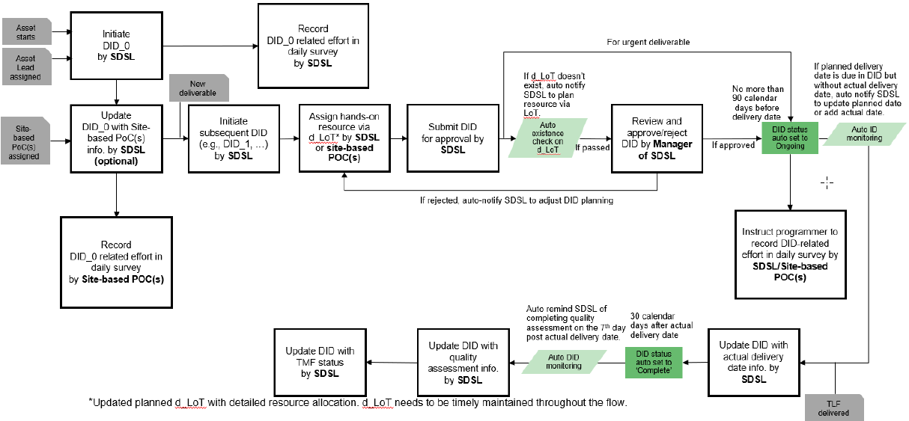

.. include:: nav.rst

SDSA DID Management for L-Seagen
==============================================
Pfizer's SDS DID Management is a centralized platform for SDSA colleagues to record daily project work and manage end-to-end deliverable lifecycle. 

The Pfizer DID reference materials for Study Programmers can be found in the following files. Please review the files prior to using the platform.

* `01 SDSA Deliverable ID (DID)_demo.mp4 <https://pfizer.sharepoint.com/:v:/r/sites/SPAaccelerator/Repository/Pfizer_vendors/01%20SDSA%20Deliverable%20ID%20(DID)_demo.mp4?csf=1&web=1&e=kwcPKy>`__
* `03 SDSA DID management user manual.pdf <https://pfizer.sharepoint.com/:b:/r/sites/SPAaccelerator/Repository/Pfizer_vendors/03%20SDSA%20DID%20management%20user%20manual.pdf?csf=1&web=1&e=5pWRbJ>`__

.. toctree::
   :maxdepth: 2
   :caption: L-Seagen Guidance Contents

    Create a Study <study>
    Create a Deliverable <deliverable>
    Create and Upload LoT <lot>
    Complete Daily Survey <survey>
    Deliverable Completion <complete>

Workflow for DID lifecycle
-----------------------------------

