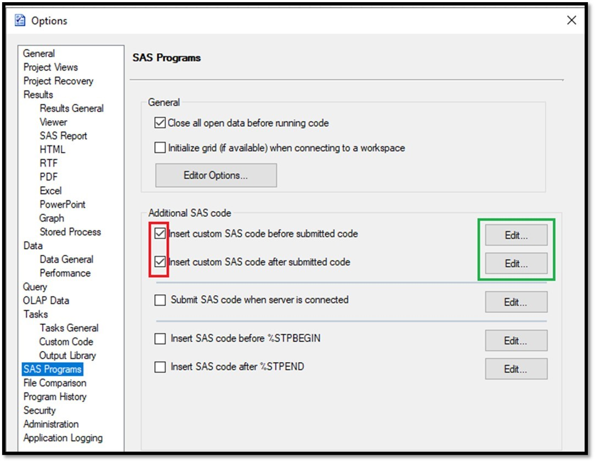

.. |xml| raw:: html

    <button style="border: 1px solid azure;border-radius: 5px;background-color: aliceblue;color:blue; padding:2px;" onclick="window.open('EGOptions.xml')">EGOptions.xml</button>

SAS Log Checker for Enterprise Guide
===========================================

Configure the Log Checker for Enterprise Guide
------------------------------------------------
#. Close SAS Enterprise Guide
#. Open |xml|, right-click and *Save As* EGOptions.xml in C:\\Users\\%username%\\AppData\\Roaming\\SAS\\EnterpriseGuide\\7.1
#. Open EG and confirm the two options were checked in red parts and to click Edit to check if checklog utility was added.

Seagen Criteria
-------------------------
`SJM documentation <https://sgcpapp1:7011/apps/sasjobmgr/logissues.html#list-of-log-issues-detected>`__

.. list-table::        
    :widths: 20 20 80
    :header-rows: 1      

    * - Line Type
      - Issue Classification
      - Regular Expression
    * - LineTypeError	
      - Error	
      - ^ERROR(:|.*:)
    * - LineTypeWarning	
      - Warning	
      - ^WARNING(:|.*:)(?!.*Unable to copy)(?!.*scheduled to expire)
    * - LineTypeNote	
      - Note	
      - #. UNINITIALIZED
        #. REPEATS OF BY VALUES
        #. W.D FORMAT
        #. ASSUMING THE SYMBOL
        #. VALUES HAVE BEEN CONVERTED TO
        #. MISSING VALUES WERE GENERATED AS A RESULT
        #. DIVISION BY ZERO DETECTED DURING
        #. OUTSIDE THE AXIS RANGE
        #. INVALID ARGUMENT TO FUNCTION
        #. MATHEMATICAL OPERATIONS COULD NOT BE PERFORMED
        #. INVALID DATA
        #. MEANING OF AN IDENTIFIER

SAS EG Checklog Utility
-----------------------------
* EG checklog utility includes all the checking criteria in the table above
* The checklog summary report will be listed in Results tab (i.e., red circle below)

    .. image:: results.png

 SAS EG Options : Tools => Options => SAS Programs
 -----------------------------------------------------
Users have the option to enable or disable the checklog utility:

   * Check both options circled in red in the picture below to enable this checklog utility,
   * Or uncheck both options to disable it.

   .. image:: options.png
   
Troubleshooting
------------------------------
If the log message does not display appropriately in log tab, please disconnect (i.e., highlighted part in right picture) and re-connect to SAS server again.

    .. image:: disconnect.png

If any questions or suggestions, please contact `Danny Hsu <shhsu@seagen.com>`__

