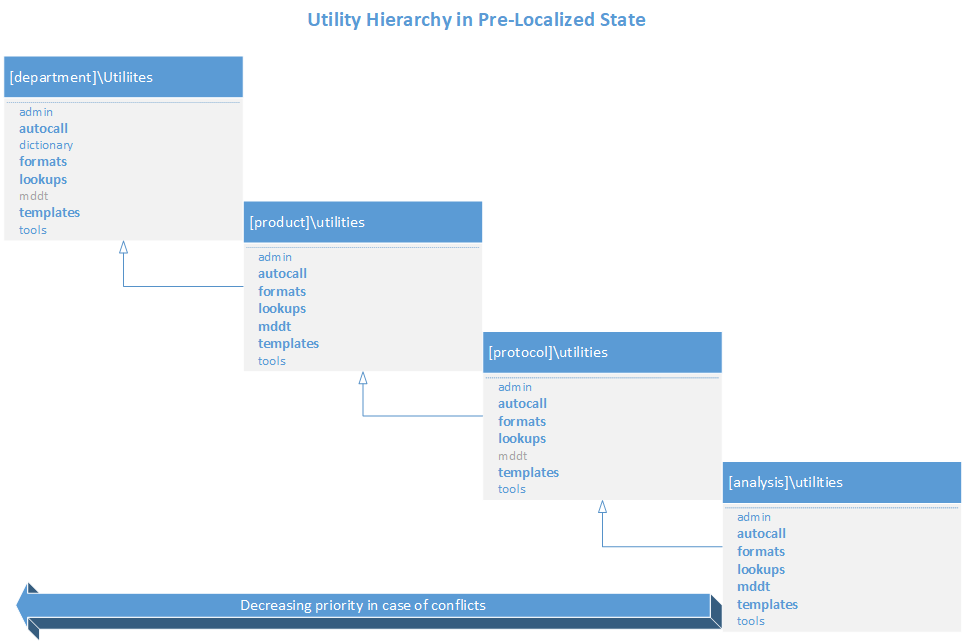
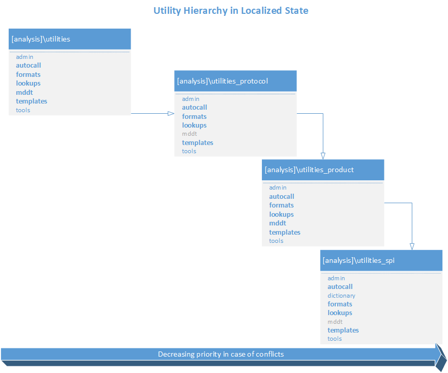

.. include:: ../global.rst

SAS Programming Environment
====================================

Initialization
-------------------------
The first line of code in every SAS program in a pgms or testing subfolder is **%include "init.sas"**. The implicit path for this file is on the SAS application server under the
[SAS]\\Config\\Lev1\\[server]. The init macro creates macro variables that define the calling program's location, which in turn includes *link.sas*.   Link.sas defines the ROOT macro variable and includes 
[root]\\utilities\tools\\env.sas. The *env.sas* program is responsible for initializing the SAS programming environment. Lastly, env.sas includes *init_supp.sas*, which provides enables the programmer to 
customize the environment. See figure for initalization flow (:ref:`env_init`).

Init_supp.sas
-----------------
The init_sup.sas file provides a place to extend the default environment. Use this file to define supplemental elements (e.g. macro variables,
fileref, librefs, ect..) centrally rather than in individual files. The following are some guidelines for using init_supp 

* Declare macro variable %global prior to assignment to ensure they are in the scope of the calling program:

      .. code-block::

            %global mvar;
            %let mvar=my value;

* Assign the value of *dbl_date* and *dco_date* in ISO format, i.e., 2020-05-20 instead of 20MAY2020, as standard analysis-level variables
* Avoid defining macros within the init_supp.sas file, use the autocall folder for this activity
* Use macro variables to create dynamic paths instead of defining static paths. This will enable init_supp.sas to function seamlessly when copied to another version within the analysis. Always consider if the 
  code will execute without change in a new version. For example, if you wanted to create a reference to a history folder under \\data\\adam, use the macro variables created from env.sas:

      .. code-block::

         %let histpath=&root.\&draft.\data\adam\history;
         %sysexec md "&histpath" ;
         libname history "&histpath";

Macro variables
-------------------------------
Env.sas defines an abundance of macro variables intended to allow programmers to create dynamic programs that will work seamless when moved between versions, or even analyses. 

Static macro variables 
+++++++++++++++++++++++++++++
Static macro variables are defined in the ALM v3 :ref:`alm_mvar` View. Contact SPI for assistance with modification of the department macro variables. 

Dyanamic macro variables 
++++++++++++++++++++++++++++++++
Dynamic macro variables are defined by the application at executing time based on the selections made during the creation of the folder structure using ALM. 
         
      =========== =======================================================================================================================================================================================================
      Name        Description
      =========== =======================================================================================================================================================================================================
      ALMVERSION  Version number of ALM used to create the analysis
      ANALYSIS    Name of the folder at the analysis level of the path of the calling program
      CANDIDID    Unique identifier for an analysis in Candid
      CURRDIR     Path of the calling program
      DEBUG       Y or N flag used by SPI to conditionally execute debugging code
      DRAFT       Name of the folder at the version level of the path of the calling program
      DRIVE       Name of the drive alias of the path of the calling program
      FOLDERLEVEL Folder hierarchy level of the calling program: SPI, Product, Protocol, Analysis
      INIFLDR[n]  Indexed macro variables that capture the components of the path of the calling program from
      INILASTDIR  Index of the deepest INIFLDR[n] macro variable.     
      ISDRAFT     Binary macro variable that indicates if the analysis has a version level folder. This will always be 1 in the new environment for Statistical Programming
      ISLOCALIZED Binary macro variable that indicates if the analysis dependencies have been moved to the analysis level (islocalized=1) or if the environment inherits from the parent folder hierarchy (islocalized=0)
      LASTFOLDER  Name of the folder captured in the last dynamic INIFLDR[n] macro variable
      OUTDIR      Path to the OUT libref. Use for directing output files
      PGMDIR      Path and name of the calling program
      PGMNAME     Name of the calling program without an extension
      PRODUCT     Name of the folder at the product level of the path of the calling program
      PROJECT     Name of the folder at the protocol level of the path of the calling program
      ROOT        Path to the analysis-level folder, one folder above version.
      ROOTFOLDER  Name of the folder at the analysis level
      SASVERSION  Major and minor version number of SAS foundation without punctuation (e.g.sasversion= 94)
      TEAM        Name of the department-level folder of the path of the calling program
      UPDIR       Path to one folder about the calling program’s location     
      =========== =======================================================================================================================================================================================================

Dynamic macro variables from Folder Template
+++++++++++++++++++++++++++++++++++++++++++++++++++
These macro variables are declared in the folder template and assigned at execution time based on the selections made during the creation of the folder structure using ALM. Different 
templates will have different macro variables. Below is and example of the types of macro variables created using the *Stat Programming* template:
         
      ================= ============================================================================================================================
      Name              Description
      ================= ============================================================================================================================
      ADAMPATH          Path to [analysis]\\data\\adam folder of the calling program
      ADMINPATH         Path to the calling program-level [path]\\utilities\\admin folder
      AUTOPATH          Path to the calling program-level [path]\\utilities\\autocall folder
      AUTOPATH_PRODUCT  Path to the analysis-level autocall folder for autocall macros stored at the product level folder in the folder hierarchy
      AUTOPATH_PROTOCOL Path to the analysis-level autocall folder for autocall macros stored at the protocol level folder in the folder hierarchy
      AUTOPATH_SPI      Path to the analysis-level autocall folder for autocall macros stored at the department level folder in the folder hierarchy
      FMTPATH           Path to the calling program-level [path]\\utilities\\formats folder
      FMTPATH_PRODUCT   Path to the analysis-level formats folder for format catalogs stored at the product level folder in the folder hierarchy
      FMTPATH_PROTOCOL  Path to the analysis-level formats folder for format catalogs stored at the protocol level folder in the folder hierarchy
      FMTPATH_SPI       Path to the analysis-level formats folder for format catalogs stored at the department level folder in the folder hierarchy
      LUPATH            Path to the calling program-level [path]\\utilities\\lookups folder
      LUPATH_PRODUCT    Path to the analysis-level formats folder for lookup tables stored at the product level folder in the folder hierarchy
      LUPATH_PROTOCOL   Path to the analysis-level formats folder for lookup tables stored at the protocol level folder in the folder hierarchy
      LUPATH_SPI        Path to the analysis-level formats folder for lookup tables stored at the department level folder in the folder hierarchy
      MDDTPATH          Path to the [product]\\utilities\\mddt folder of the calling program
      PTPRFPATH         Path to [analysis]\\outputs\\profiles folder of the calling program
      RAWPATH           Path to [analysis]\\data\\raw folder of the calling program
      SDTMPATH          Path to [analysis]\\data\\sdtm folder of the calling program
      TMPLPATH          Path to the calling program-level [path]\\utilities\\templates folder
      TMPLPATH_PRODUCT  Path to the analysis-level templates folder for lookup tables stored at the product level folder in the folder hierarchy
      TMPLPATH_PROTOCOL Path to the analysis-level templates folder for lookup tables stored at the protocol level folder in the folder hierarchy
      TMPLPATH_SPI      Path to the analysis-level templates folder for lookup tables stored at the department level folder in the folder hierarchy
      TOOLPATH          Path to the calling program-level [path]\\utilities\\tools folder
      ================= ============================================================================================================================      

Library References
-----------------------------
The library references created in env.sas are the result of the template used to create the folder structure in ALM. Below are examples of typical librefs defined in env.sas 
created using the *Stat Programming* template

Non-utility librefs at the analysis level
++++++++++++++++++++++++++++++++++++++++++++++++

      =========== =============================================================================================================================================================================================================================
      Libname     Location
      =========== =============================================================================================================================================================================================================================
      A           [analysis]\\data\\adam
      B           [analysis]\\biostats\\data
      CDM         [source data path] can be anywhere, but typically under data management
      OUT         The only writeable libref. For SAS program in a ‘pgms’ subfolder, OUT is one level above the calling program’s location. For SAS programs in a ‘testing’ subfolder, OUT is the same folder as the calling program’s location.
      PA          [analysis]\\data\\profile_analysis
      PR          [analysis]\\data\\profile_raw
      R           [analysis]\\data\\raw
      S           [analysis]\\data\\sdtm
      UP          One level about the calling program     
      =========== =============================================================================================================================================================================================================================

Non-utility librefs at the [protocol]\\current\\pgms or [protocol]\\current\\exploratory\\[category]\\pgms
+++++++++++++++++++++++++++++++++++++++++++++++++++++++++++++++++++++++++++++++++++++++++++++++++++++++++++++++

      =========== =============================================================================================================================================================================================================================
      **Libname** **Location**
      =========== =============================================================================================================================================================================================================================
      B           [protocol]\\current\\exploratory\\data
      CDM         [source data path] can be anywhere, but typically under data management
      CURRENT     [protocol]\\current
      ISAFE       [protocol]\\iSAFE
      OUT         The only writeable libref. For SAS program in a ‘pgms’ subfolder, OUT is one level above the calling program’s location. For SAS programs in a ‘testing’ subfolder, OUT is the same folder as the calling program’s location.
      UP          One level about the calling program                  
      =========== =============================================================================================================================================================================================================================

Utility librefs
+++++++++++++++++++++++++
The utility librefs are concatenated references to the utility\\[category] subfolder from the version to the department level. 

=========== =============== =====================================================
Libname     Description     Location
=========== =============== =====================================================
L           Reference data  \\utilities\\lookups
LIBRARY     Format catalogs \\utilities\\formats
T           Style templates \\utilities\\templates
=========== =============== =====================================================

Options 
-------------------------
The application sets the following options:

  * minoperator mindelimiter=|         
  * validvarname=upcase
  * options fmtsearch=(work library library.fmtdept);
  * options mautosource mrecall sasautos=("[analysis]\\utilites\\autocall" "[protocol]\\utilities\\autocall" "[product]\\utilites\\autocall" "[spi]\\utilities\\autocall" SASAUTOS)
  
.. _env_init:

SAS program environment initialization
----------------------------------------------------

      .. image:: init.png  

Localization effect on the folder hierarchy
--------------------------------------------------
In the pre-localized state, the hierarchy extends from the version to the department level. Precedence is given to objects closest to the calling program in the event of collisions. Regardless of 
localization state, the same precedence is maintained for programs under the analysis level. 

After localization, the precedence is maintained, but all the dependencies are moved to level-specific subfolder within the version folder

