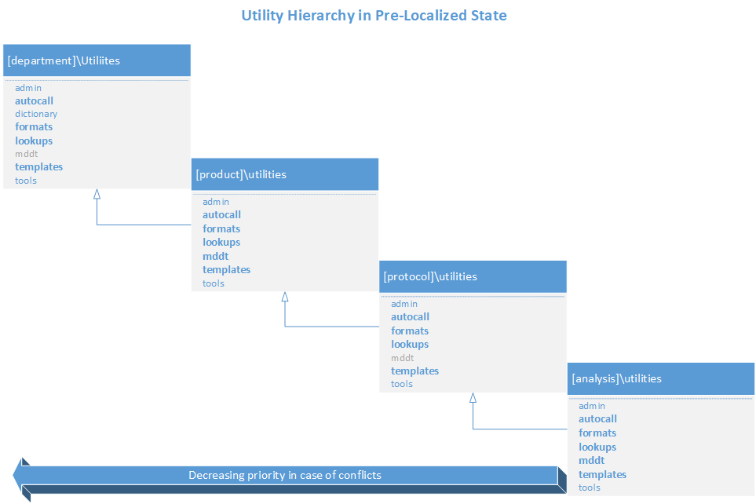
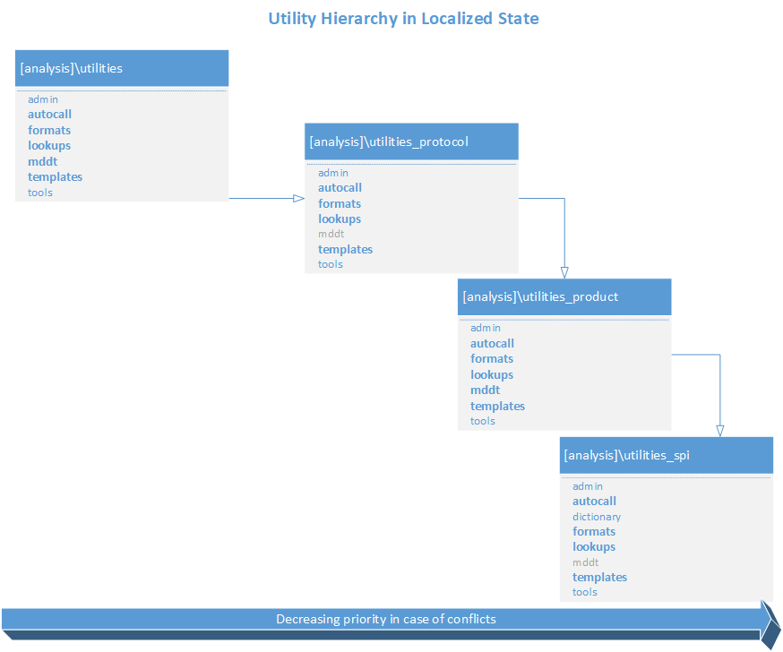

.. include:: ../global.rst

SAS Programming Environment
====================================

Initialization
-------------------------
The first line of code in every SAS program in a pgms or testing subfolder is **%include "init.sas"**. The implicit path for this file is on the SAS application server under the
[SAS]\\Config\\Lev1\\[server]. The init macro creates macro variables that define the calling program's location, which in turn includes *link.sas*.   Link.sas defines the ROOT macro variable and includes 
[root]\\utilities\tools\\env.sas. The *env.sas* program is responsible for initializing the SAS programming environment. Lastly, env.sas includes *init_supp.sas*, which provides enables the programmer to 
customize the environment. See figure for initalization flow (:ref:`env_init`).

Init_supp.sas
-----------------
The init_sup.sas file provides a place to extend the default environment. Use this file to define supplemental elements (e.g. macro variables,
fileref, librefs, ect..) centrally rather than in individual files.

.. list-table:: 
  :widths: 20 40 40
  :header-rows: 1

  * - Setting
    - Usage
    - Example
  * - System options
    - Use this section to modify options like sasautos, fmtsearch. 
    - For SPI testing, append the UAT location to autocall library |r| options append=(sasautos="O:\\stat_prog_infra\\utilities_uat\\autocall");
  * - Macro variable
    - Global macro variables for all programs in the analysis **MUST BE DECLARED GLOBAL PRIOR TO ASSIGNMENT**
    - %global dbl_date; |r| %let dbl_date =  2020-05-20;
  * - Library/file references
    - librefs to non-standard Locations - always use macro variables if possible
    - libname history "&root.\\&draft.\\data\\adam\\history";
  * - Macro calls
    - If there is an study-specific initialization macro, add it header
    - %include “&mddtpath\mcr_spi_ct_<study column header name in CT MDDT>.sas”;

* Declare macro variable %global prior to assignment to ensure they are in the scope of the calling program:

      .. code-block::

            %global mvar;
            %let mvar=my value;

Init_supp.sas 
-----------------
* Assign the value of *dbl_date* and *dco_date* in ISO format, i.e., 2020-05-20 instead of 20MAY2020, as standard analysis-level variables
* Avoid defining macros within the init_supp.sas file, use the autocall folder for this activity
* Use macro variables to create dynamic paths instead of defining static paths. This will enable init_supp.sas to function seamlessly when copied to another version within the analysis. Always consider if the 
  code will execute without change in a new version. For example, if you wanted to create a reference to a history folder under \\data\\adam, use the macro variables created from env.sas:

Do not use init_supp.sas for the following:

  * Defining macros - use the utilities\\autocall folder to store the macro definition.
  * Lookup tables - use the utilities\\lookups folder to created lookup tables

Required items that must be defined for each analysis

  #. DBL_DATE in the format: %str(2020-10-21); 
  #. DCO_DATE in the format: %str(2020-10-21);
  #. Include the Controlled Terminology macro: *%include "&mddtpath\\mcr_spi_ct_<study column header name in CT MDDT>.sas";*
  #. If this is for SPI user testing, append the SPI UAT library to SASAUTOS

      .. code:: 

        options append=(sasautos="O:\stat_prog_infra\utilities_uat\autocall");

.. warning::

  Use macro variables to create dynamic paths instead of defining static paths. This will enable init_supp.sas to function seamlessly when copied to another version within the analysis. 
  Always consider if the code will execute without change in a new version. For example, if you wanted to create a reference to a history folder under \\data\\adam, use the macro 
  variables created from env.sas:

  .. code-block::

      %let histpath=&root.\&draft.\data\adam\history;
      %sysexec md "&histpath" ;
      libname history "&histpath";

Macro variables
-------------------------------
Env.sas defines an abundance of macro variables intended to allow programmers to create dynamic programs that will work seamlessly when moved between versions or analyses. 

Static macro variables 
+++++++++++++++++++++++++++++
Static macro variables are defined in the ALM v3 :ref:`alm_mvar` View. To see the currrent list, open ALM macro variables view. Contact SPI for assistance with modification of the department macro variables. 

Dyanamic macro variables 
++++++++++++++++++++++++++++++++
Dynamic macro variables are defined by the application at executing time based on the selections made during the creation of the folder structure using ALM. 
         
=========== =======================================================================================================================================================================================================
Name        Description
=========== =======================================================================================================================================================================================================
ALMVERSION  Version number of ALM used to create the analysis
ANALYSIS    Name of the folder at the analysis level of the path of the calling program
CANDIDID    Unique identifier for an analysis in Candid
CURRDIR     Path of the calling program
DEBUG       Y or N flag used by SPI to conditionally execute debugging code
DRAFT       Name of the folder at the version level of the path of the calling program
DRIVE       Name of the drive alias of the path of the calling program
FOLDERLEVEL Folder hierarchy level of the calling program: SPI, Product, Protocol, Analysis
INIFLDR[n]  Indexed macro variables that capture the components of the path of the calling program from
INILASTDIR  Index of the deepest INIFLDR[n] macro variable.     
ISDRAFT     Binary macro variable that indicates if the analysis has a version level folder. This will always be 1 in the new environment for Statistical Programming
ISLOCALIZED Binary macro variable that indicates if the analysis dependencies have been moved to the analysis level (islocalized=1) or if the environment inherits from the parent folder hierarchy (islocalized=0)
LASTFOLDER  Name of the folder captured in the last dynamic INIFLDR[n] macro variable
OUTDIR      Path to the OUT libref. Use for directing output files
PGMDIR      Path and name of the calling program
PGMNAME     Name of the calling program without an extension
PRODUCT     Name of the folder at the product level of the path of the calling program
PROJECT     Name of the folder at the protocol level of the path of the calling program
ROOT        Path to the analysis-level folder, one folder above version.
ROOTFOLDER  Name of the folder at the analysis level
SASVERSION  Major and minor version number of SAS foundation without punctuation (e.g.sasversion= 94)
TEAM        Name of the department-level folder of the path of the calling program
UPDIR       Path to one folder about the calling program’s location     
=========== =======================================================================================================================================================================================================

Dynamic macro variables from Folder Template
+++++++++++++++++++++++++++++++++++++++++++++++++++
These macro variables are declared in the folder template and assigned at execution time based on the selections made during the creation of the folder structure using ALM. Different 
templates will have different macro variables. Below is and example of the types of macro variables created using the *Stat Programming* template:
         
========================= ============================================================================================================================
Name                      Description
========================= ============================================================================================================================
ADAMPATH                  Path to [analysis]\\data\\adam folder of the calling program
ADMINPATH                 Path to the calling program-level [path]\\utilities\\admin folder
AUTOPATH                  Path to the calling program-level [path]\\utilities\\autocall folder
AUTOPATH_PRODUCT          Path to the analysis-level autocall folder for autocall macros stored at the product level folder in the folder hierarchy
AUTOPATH_PROTOCOL         Path to the analysis-level autocall folder for autocall macros stored at the protocol level folder in the folder hierarchy
AUTOPATH_SPI              Path to the analysis-level autocall folder for autocall macros stored at the department level folder in the folder hierarchy
FMTPATH                   Path to the calling program-level [path]\\utilities\\formats folder
FMTPATH_PRODUCT           Path to the analysis-level formats folder for format catalogs stored at the product level folder in the folder hierarchy
FMTPATH_PROTOCOL          Path to the analysis-level formats folder for format catalogs stored at the protocol level folder in the folder hierarchy
FMTPATH_SPI               Path to the analysis-level formats folder for format catalogs stored at the department level folder in the folder hierarchy
LUPATH                    Path to the calling program-level [path]\\utilities\\lookups folder
LUPATH_PRODUCT            Path to the analysis-level formats folder for lookup tables stored at the product level folder in the folder hierarchy
LUPATH_PROTOCOL           Path to the analysis-level formats folder for lookup tables stored at the protocol level folder in the folder hierarchy
LUPATH_SPI                Path to the analysis-level formats folder for lookup tables stored at the department level folder in the folder hierarchy
MEDDRAPATH                Path to the calling program-level [path]\\utilities\\meddra folder
MEDDRAPATH_PRODUCT        Path to the product-level [path]\\utilities\\meddra folder
MEDDRAPATH_PROTOCOL       Path to the protcol-level [path]\\utilities\\meddra folder
MEDDRAPATH_SPI            Path to the department-level [path]\\utilities\\meddra folder
MDDTPATH                  Path to the [product]\\utilities\\mddt folder of the calling program
PTPRFPATH                 Path to [analysis]\\outputs\\profiles folder of the calling program
RAWPATH                   Path to [analysis]\\data\\raw folder of the calling program
SDTMPATH                  Path to [analysis]\\data\\sdtm folder of the calling program
TMPLPATH                  Path to the calling program-level [path]\\utilities\\templates folder
TMPLPATH_PRODUCT          Path to the analysis-level templates folder for lookup tables stored at the product level folder in the folder hierarchy
TMPLPATH_PROTOCOL         Path to the analysis-level templates folder for lookup tables stored at the protocol level folder in the folder hierarchy
TMPLPATH_SPI              Path to the analysis-level templates folder for lookup tables stored at the department level folder in the folder hierarchy
TOOLPATH                  Path to the calling program-level [path]\\utilities\\tools folder
WHODRUGPATH               Path to the calling program-level [path]\\utilities\\whodrug folder
WHODRUGPATH_PRODUCT       Path to the product-level [path]\\utilities\\whodrug folder
WHODRUGPATH_PROTOCOL      Path to the protocol-level [path]\\utilities\\whodrug folder
WHODRUGPATH_SPI           Path to the department-level [path]\\utilities\\whodrug folder
========================= ============================================================================================================================      

Library References
-----------------------------
The library references created in env.sas are the result of the template used to create the folder structure in ALM. Below are examples of typical librefs defined in env.sas 
created using the *Stat Programming* template

Non-utility librefs at the analysis level
++++++++++++++++++++++++++++++++++++++++++++++++

      =========== =============================================================================================================================================================================================================================
      Libname     Location
      =========== =============================================================================================================================================================================================================================
      A           [analysis]\\data\\adam
      B           [analysis]\\biostats\\data
      CDM         [source data path] can be anywhere, but typically under data management
      OUT         The only writeable libref. For SAS program in a ‘pgms’ subfolder, OUT is one level above the calling program’s location. For SAS programs in a ‘testing’ subfolder, OUT is the same folder as the calling program’s location.
      PA          [analysis]\\data\\profile_analysis
      PR          [analysis]\\data\\profile_raw
      R           [analysis]\\data\\raw
      S           [analysis]\\data\\sdtm
      UP          One level about the calling program     
      =========== =============================================================================================================================================================================================================================

Non-utility librefs at the [protocol]\\current\\pgms or [protocol]\\current\\exploratory\\[category]\\pgms
+++++++++++++++++++++++++++++++++++++++++++++++++++++++++++++++++++++++++++++++++++++++++++++++++++++++++++++++

      =========== =============================================================================================================================================================================================================================
      **Libname** **Location**
      =========== =============================================================================================================================================================================================================================
      B           [protocol]\\current\\exploratory\\data
      CDM         [source data path] can be anywhere, but typically under data management
      CURRENT     [protocol]\\current
      ISAFE       [protocol]\\iSAFE
      OUT         The only writeable libref. For SAS program in a ‘pgms’ subfolder, OUT is one level above the calling program’s location. For SAS programs in a ‘testing’ subfolder, OUT is the same folder as the calling program’s location.
      UP          One level about the calling program                  
      =========== =============================================================================================================================================================================================================================

Utility libraries
+++++++++++++++++++++++++
The utility libraries occur at each level of the folder hierarchy. At the analysis level, the assigmnment is dependent on the localization state. 

Pre-localized utility libraries
^^^^^^^^^^^^^^^^^^^^^^^^^^^^^^^^^^^^^^^^

.. list-table:: 
  :widths: 10 5 25 45 15
  :header-rows: 1

  * - Type
    - Name
    - Description
    - Locations in descending order of precedence (pre-localization)
    - Macro variable that captures coresponding path
  * - Autocall library
    - n/a
    - Autocall macro library
    - #. &root.\\&draft.\\utilities\\autocall
      #. O:\\projects\\&product.\\&project.\\utilities\\autocall
      #. O:\\projects\\&product.\\utilities\\autocall
      #. O:\\projects\\utilities\\autocall
      #. SASAUTOS
    - #. AUTOPATH
      #. AUTOPATH_PROTOCOL
      #. AUTOPATH_PRODUCT
      #. AUTOPATH_SPI       
  * - Libref
    - L
    - Lookup table and reference data
    - #. &root.\\&draft.\\utilities\\lookups
      #. O:\\projects\\&product.\\&project.\\utilities\\lookups
      #. O:\\projects\\&product.\\utilities\\lookups
      #. O:\\projects\\utilities\\lookups
    - #. LUPATH 
      #. LUPATH_PROTOCOL
      #. LUPATH_PRODUCT
      #. LUPATH_SPI
  * - Libref
    - LIBRARY
    - Format catalogs
    - #. &root.\\&draft.\\utilities\\formats
      #. O:\\projects\\&product.\\&project.\\utilities\\formats
      #. O:\\projects\\&product.\\utilities\\formats
      #. O:\\projects\\utilities\\formats
    - #. FMTPATH 
      #. FMTPATH_PROTOCOL
      #. FMTPATH_PRODUCT
      #. FMTPATH_SPI
  * - Libref
    - meddra
    - MedDRA dictionary reference tables
    - #. &root.\\&draft.\\utilities\\meddra
      #. O:\\projects\\&product.\\&project.\\utilities\\meddra
      #. O:\\projects\\&product.\\utilities\\meddra
      #. O:\\projects\\utilities\\meddra
    - #. MEDDRAPATH 
      #. MEDDRAPATH_PROTOCOL
      #. MEDDRAPATH_PRODUCT
      #. MEDDRAPATH_SPI          
  * - Libref
    - MDDT
    - Master data definion table
    - O:\\projects\\&product.\\utilities\\mddt
    - MDDTPATH   
  * - Libref
    - T
    - Style templates
    - #. &root.\\&draft.\\utilities\\templates
      #. O:\\projects\\&product.\\&project.\\utilities\\templates
      #. O:\\projects\\&product.\\utilities\\templates
      #. O:\\projects\\utilities\\templates
    - #. TMPLPATH 
      #. TMPLPATH_PROTOCOL
      #. TMPLPATH_PRODUCT
      #. TMPLPATH_SPI     
  * - Libref
    - whodrug
    - WHODrug dictionary reference tables
    - #. &root.\\&draft.\\utilities\\whodrug
      #. o:\\projects\\&product.\\&project.\\utilities\\whodrug
      #. o:\\projects\\&product.\\utilities\\whodrug
      #. o:\\projects\\utilities\\whodrug
    - #. WHODRUGPATH 
      #. WHODRUGPATH_PROTOCOL
      #. WHODRUGPATH_PRODUCT
      #. WHODRUGPATH_SPI            
               
Localized utility libraries
^^^^^^^^^^^^^^^^^^^^^^^^^^^^^^^^^^^^^

.. list-table:: 
  :widths: 10 5 25 45 15
  :header-rows: 1

  * - Type
    - Name
    - Description
    - Locations in descending order of precedence (localized)
    - Macro variable that captures coresponding path
  * - Autocall library
    - n/a
    - Autocall macro library
    - #. &root.\\&draft.\\utilities\\autocall
      #. &root.\\&draft.\\utilities_protocol\\autocall
      #. &root.\\&draft.\\utilities_product\\autocall
      #. &root.\\&draft.\\utilities_spi\\autocall
      #. SASAUTOS
    - #. AUTOPATH
      #. AUTOPATH_PROTOCOL
      #. AUTOPATH_PRODUCT
      #. AUTOPATH_SPI       
  * - Libref
    - L
    - Lookup table and reference data
    - #. &root.\\&draft.\\utilities\\lookups
      #. &root.\\&draft.\\utilities_protocol\\lookups
      #. &root.\\&draft.\\utilities_product\\lookups
      #. &root.\\&draft.\\utilities_spi\\lookups
    - #. LUPATH 
      #. LUPATH_PROTOCOL
      #. LUPATH_PRODUCT
      #. LUPATH_SPI
  * - Libref
    - LIBRARY
    - Format catalogs
    - #. &root.\\&draft.\\utilities\\formats
      #. &root.\\&draft.\\utilities_protocol\\formats
      #. &root.\\&draft.\\utilities_product\\formats
      #. &root.\\&draft.\\utilities_spi\\formats
    - #. FMTPATH 
      #. FMTPATH_PROTOCOL
      #. FMTPATH_PRODUCT
      #. FMTPATH_SPI
  * - Libref
    - meddra
    - MedDRA dictionary reference tables
    - #. &root.\\&draft.\\utilities\\meddra
      #. &root.\\&draft.\\utilities_protocol\\meddra
      #. &root.\\&draft.\\utilities_product\\meddra
      #. &root.\\&draft.\\utilities_spi\\meddra
    - #. MEDDRAPATH 
      #. MEDDRAPATH_PROTOCOL
      #. MEDDRAPATH_PRODUCT
      #. MEDDRAPATH_SPI        
  * - Libref
    - MDDT
    - Master data definion table
    - &root.\\&draft.\\utilities_product\\mddt
    - MDDTPATH   
  * - Libref
    - T
    - Style templates
    - #. &root.\\&draft.\\utilities\\templates
      #. &root.\\&draft.\\utilities_protocol\\templates
      #. &root.\\&draft.\\utilities_product\\templates
      #. &root.\\&draft.\\utilities_spi\\templates
    - #. TMPLPATH 
      #. TMPLPATH_PROTOCOL
      #. TMPLPATH_PRODUCT
      #. TMPLPATH_SPI      
  * - Libref
    - whodrug
    - WHODrug dictionary reference tables
    - #. &root.\\&draft.\\utilities\\whodrug
      #. &root.\\&draft.\\utilities_protocol\\whodrug
      #. &root.\\&draft.\\utilities_product\\whodrug
      #. &root.\\&draft.\\utilities_spi\\whodrug
    - #. WHODRUGPATH 
      #. WHODRUGPATH_PROTOCOL
      #. WHODRUGPATH_PRODUCT
      #. WHODRUGPATH_SPI         

    
.. note::

      At any level above analysis, the unsuffixed macro variable (e.g. LUPATH) refers to the location of library at the level of the calling program. This allows programmers to use the same code 
      at different levels of the hierarchy (e.g. promote lbgraded from the analysis to the protocol level) 

      Example: 
      In a program at the protocol level, *O:\\projects\\[product]\\[protocol]\\current\\pgms\\lbgraded.sas* the value of LUPATH is O:\\projects\\[product]\\[protocol]\\utilities\\lookups.

Style Templates 
------------------------------
Stat Programming uses style templates to enforce a consistent appearance for TLFs. The library of available templates is contained in an item store under O:\\projects\\utilities\\templates\\template.sas7bitm. 
The templates in the item store are exposed to the SAS programming environment in env.sas. Within env.sas, a libname statement creates a concatenated libref to include all the 
locations in the hierarchy intended for SAS item stores. Then the ODS PATH statement sequentially defines the locations SAS will search for templates. The ODS PATH statement also defines 
the permissions for the item store. By default, users can only write to the work.templat item store and anything you define there will have the highest priority, but it's scope is only as 
long as the session. Read more about template stores in the `SAS TEMPLATE procedure docs <https://documentation.sas.com/?docsetId=odsproc&docsetTarget=p1eqi2walqtay0n1ak3r9aoqocl6.htm&docsetVersion=9.4&locale=en>`_

.. code::

    libname T ("&root.\v01\utilities\templates"
      "&root.\v01\utilities_protocol\templates"
      "&root.\v01\utilities_product\templates"
      "&root.\v01\utilities_spi\templates"
      ) access=readonly;

    ods path reset;

    ods path work.templat(write) T.template(read) sasuser.templat(read) sashelp.tmplmst(read); 

Examine the contents of a SAS item store
++++++++++++++++++++++++++++++++++++++++++++++++
Item stores that contain templates can be accessed using PROC TEMPLATE. Use *ODS path show;* statement to display the sequential list of 
locations and permissions for the TEMPLATE procedure. Examine the directories and items of a template store using the *LIST* statement. Use the *SOURCE*  statement to view the template 
definition either in the log or direct the content to an external file. 

.. code:: 

    ods path show;

    proc template;
      *------------------------------------------------------------------------*
      | List the contents of the SPI template store
      *------------------------------------------------------------------------*;
      list / store=t.template;
      *----------------------------------------------------------------------*
      | Write the definition of the rtftnr10 template to the log and external file
      *----------------------------------------------------------------------*;
      source rtftnr10;
      source rtftnr10 / file="&outdir.\rtftnr10-def.tpl";
    run;

Create an item store and add templates
++++++++++++++++++++++++++++++++++++++++++++++++
Users can create items stores at the product, protocol, and analysis level to support custom reporting requirements. The fastest way to create a new style, is to inherit from an 
existing template and modify the style elements as needed. To do this, first create a program in the \\utilities\\templates\\pgms folder at the appropriate level with %inc "init"; as the 
first line. Then follow the steps below:

#. Direct the template to a new item store by prepending the item store with write to the ODS path. Do this in the program file itself, not init_supp.sas. The scope of write access is limited to 
   just this program. 

    .. code:: 

        ods path (prepend)out.mytemplates(write);

#. Define the style template. In the example below, the new template inherits from SeaGen standard template and sets the margins smaller and maximizes the table area. See the full 
   list of style elements in the `SAS 9.4 ODS Users Guide <https://documentation.sas.com/?docsetId=odsug&docsetTarget=p16od8jghibo9tn187hloazdzt70.htm&docsetVersion=9.4&locale=en>`_

    .. code::

        proc template;                   
          define style mytemplate2;
            parent = rtftnr10;
            style body from body /
                leftmargin = 0.1in
                rightmargin = 0.1in
                topmargin = 0.1in
                bottommargin = 0.1in;
            replace table from output /
                outputwidth=100%;
          end;
        run;      

#. Observe the item store has been created in the OUT libref and the log file has the following note: 

   *NOTE: STYLE [name] hs been saved to OUT.[Template name].*
   
   If you see it saved to WORK.TEMPLAT, a program had a lock on the item store and you program fail to update the template.

   .. note:: 

      For existing item stores, use the (update) argument to enable modify access without creating a new item store. 

Organizing item stores
+++++++++++++++++++++++++++++++++++
Item stores can support multiple directories within the structure. This can be used to logically group items by category (e.g. RTF styles, Excel styles, Statgraph templates, ect...). This is 
achieved by adding one or more levels to the names of the templates. 

.. code:: 

      ods path (prepend)out.iSafeTemplates(write);

      proc template;                   
        define style xls.blue;
          parent = styles.htmlblue;
        end;
        define style xls.green;
          parent = styles.htmlblue;
          class  data /
                background=green;    
        end;
        define style tbl.rtf_minimal;
          parent=styles.minimal;
          style table from table /
            bordertopstyle = solid
            bordertopwidth = 1
            borderspacing = .25pt
            cellpadding = 1.5pt
            frame = lhs
            rules = rows;
        end;
      run;

Expose and reference custom templates for TLF programs
++++++++++++++++++++++++++++++++++++++++++++++++++++++++++++++
In order to reference the style templates within a TLF program, the item store must be added to the ODS PATH. In init_supp.sas, add the store to the existing ODS path using the 
PREPEND option to give the custom template priority. Always specify READ access to safeguard against accidentally corrupting a template. Use (append) 
if you want the WORK and default templates to have priority. 

    .. code:: 

        ods path (prepend)t.mytemplates(read);

To apply a new style to the output, update the TLF program to reflect the desired template. If the output is created by a SPI macro, specify the template name in the appropriate parameter 
(e.g. mcrrtftab(rtftemplate=mytemplate2)). Or if the output is generated outside of a standard macro, specify the template in the STYLE argument on the ODS [destination] statement 
(e.g. ods rtf style=mytemplate2). 

If the user overwrote an existing template and gave it precedence in the ODS path, it will automatically use the updated version. 

.. note:: 

    If a program has a lock on a template, you will not be able to update the template. *ODS path reset;* will release the lock on the template, but you will need to re-run 
    %inc "init.sas"; to rebuild the ODS path before referencing the template again. 

Options 
-------------------------
The application sets the following options:

  * minoperator mindelimiter=|         
  * noxwait
  * validvarname=upcase
  * options fmtsearch=(work library library.fmtdept);
  * extendobscounter=NO
  * nodate 
  * nonumber 
  * orientation=landscape
  
.. toctree:: 
   :maxdepth: 1

   practices

Localization effect on the folder hierarchy
--------------------------------------------------
In the pre-localized state, the hierarchy extends from the version to the department level. Precedence is given to objects closest to the calling program in the event of collisions. Regardless of 
localization state, the same precedence is maintained for programs under the analysis level. 

After localization, the precedence is maintained, but all the dependencies are moved to level-specific subfolder within the version folder

.. _env_init:

SAS program environment initialization
----------------------------------------------------

      .. image:: init.png  
