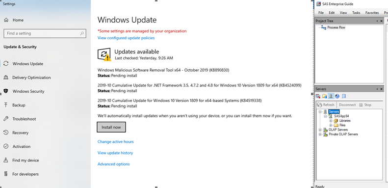
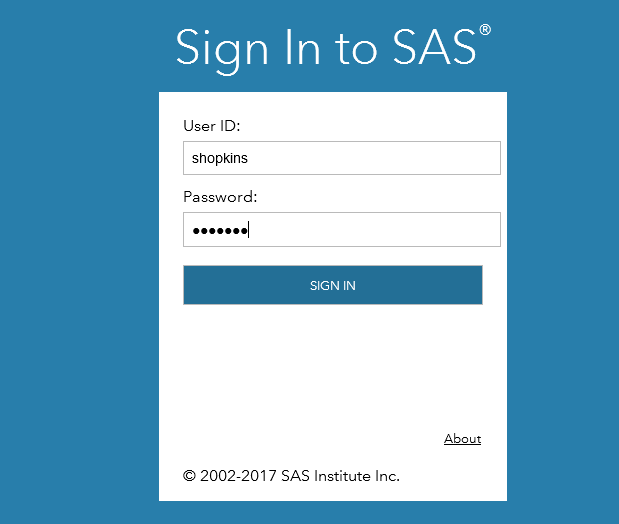

Enterprise Guide and SAS Studio Configuration
===========================================================

.. _Configure Enterprise Guide:

Enterprise Guide 
-----------------------------------
Before you can use SAS, you must connect the client application, Enterprise Guide,  to the SAS server. This is accomplished by configuring a connection profile. You will only have to do this once per computer. 
Perform the following steps to create your connection profile

#. Open SAS Enterprise Guide from the start menu. You can type SAS in the search to locate the application

    .. image:: opensas.png 

#. The first time you open EG, a dialog will alert you that no profile exists. You must create one

   .. image:: noprofile.png

#. Select Yes from the dialog, or if you closed the dialog, click the blue link in the bottom right corner of the application.

   .. image:: selectprofile.png

#. Click Add to display the Create Profile dialog. Fill in the boxes as shown below and be sure to check *Use integrated Windows Authentication*
  
    .. image:: eg-setup-server.png

    .. note:: 

       Remote server machine name: sgsasv1.sg.seagen.com for production, sgsasv1-stg.sg.seagen.com for stage

#. Click Set Active to connect to the remote server, then click Close.

    .. image:: setactive.png

#. You can observe the active connection profile in the lower right of the application

    .. image:: success.png

#. Set some options to improve your user experience. Click Tools > Options to bring up the Options menu:

    * In the General tab, uncheck Automatically check for updates

        .. image:: options_update.png

    * In the Results General tab, set Replace results to *Replace without prompting*

       .. image:: options_replace.png

    * In the Data General tab, set the valid variables names to Basic variable names (V7) to match the server options. 

        .. image:: options_upcase.png

Correct SAS Server Connection Issues
------------------------------------------
#. If SAS batch submit and SAS EG not able to connect to SAS server follow the below steps.

    * If you are using SEASASWS** VM, restart the VM using the Restart.bat file available on the desktop. Restarting the VM will resolve the connection issue. If you are not able to connect to VM after restart contact IT for help.
    * If you are using SEAGEN laptop to connect to SAS server from SAS EG client installed in the laptop follow the below steps:

        #. Goto Windows update setting and check for pending windows updates waiting to download and install as shown in the screenshot below
        #. After installing updates restart the device and try to connect to SAS server from SAS EG
        #. Open SAS Enterprise Guide and Goto servers pane > connect to SASAPP94. If if fails to connect after restart, contact *SAS Adminstrator or Service desk*

#. SAS batch submit will not work if I drive is not connected (as shown in Screenshot)
 
    .. image:: drive.png

#. SAS Enterprise Guide connection profile – Please follow steps in this link to create new connection profile in :ref:`Configure Enterprise Guide` . Also if you get the below prompt in SAS EG, select Yes and create new or set active the existing connection profile.

    .. image:: server.png

Connect to SAS Studio
------------------------------------
Click the link for the desired instance below and provide you username and password when prompted. When logging into SAS Studio, do not include the domain portion of your user name. 
Ex: Username = shopkins

**SAS Studio instances**: `Production <http://sgsasv1.sg.seagen.com/SASStudio>`__ | `Stage <http://sgsasv1-stg.sg.seagen.com/SASStudio>`__

