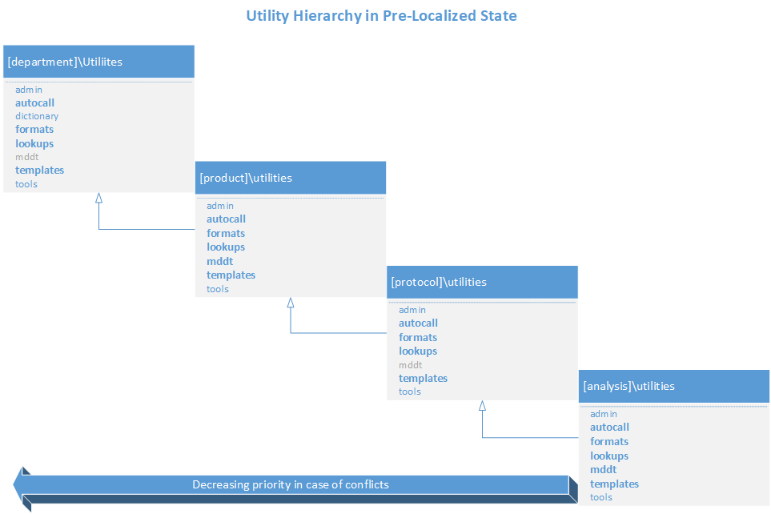

Practices to Safely Manage SAS Macro Hierarchy
=================================================================
The stored, compiled SAS macro catalog used in ALM <=v2 is considered deprecated. ALM 3 does not create any references to stored catalog (or SAS utilities on the I: drive). 

The hierarch utilities extends from the version to the department level. Precedence is given to objects closest to the calling program in the event of collisions. Regardless of 
localization state, the same precedence is maintained for programs under the analysis level. 

Adding a reference to the stored catalog will by default cause SAS to give preference to the compiled version in the stored catalog in the event of a collision (e.g. you may be using an outdated version)

If you analysis is an ALM v2 and you need an updated version of the macro, add following lines to init_supp.sas

    .. code::

            *------------------------------------------------------------------------*
            | Add a reference to the department catalog 
            *------------------------------------------------------------------------*;
            options mrecall append=sasautos=(O:\Projects\utilities\autocall);

            *------------------------------------------------------------------------*
            | For updated version of macros defined in the catalog, explictly include
            *------------------------------------------------------------------------*;
            %include "O:\Projects\utilities\autocall\mcraesummary.sas"

Practices to avoid
-------------------------
*  Don't create references in init_supp.sas to the stored macro catalog (or any SAS utility on I:)
*  Be aware that folders not created under a valid folder sub-category created by ALM are not copied into snapshots. Folders created outside of ALM are not referenced in env.sas. 

    * This folder and all of it's contents are copied
        
       .. image:: iscopied.png

    * This folder is ignored and is not copied into the snapshot

      .. image:: not-copied.png

* Do not use spaces or period in file names or folders. It can interfere when you use macro variables to create dynamic functionality. 
