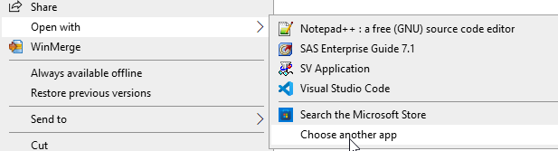
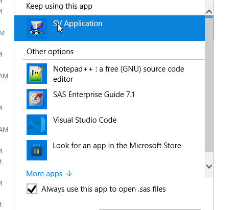
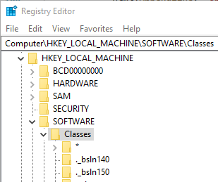
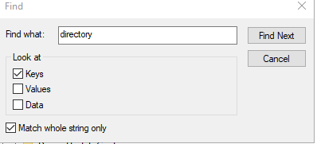

.. include:: registry_nav.rst

Troublshooting SAS Registry keys
======================================
Before installing the RunSAS context menu items, ensure that the SAS file associations are assigned as expected. 

Restoring SAS File Associations
---------------------------------------
Context menus for files appear in the right-click menu for shell commands associated with the class. A file's class can be altered by permanently associating with an application 
using the Open With > Always use this app option for opening a file. To restore SAS file classes, follow the steps listed below. For SAS Log files do the same, but select Notepad 
as the default application.

#. Right click a SAS program file and select Open With > Choose another app  |openwith|
#. Select SAS Viewer 9.1 (SV Application) and ensure the *Always use this app to open .sas files* checkbox is checked. |associate|