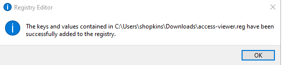

.. include:: registry_nav.rst

Context Menus for SAS Virtual Machines
================================================
SPI supports a number of context menus that enable users to call applications from the Windows file explorer based on file type.  

.. toctree::
   :maxdepth: 2
   :caption: Contents
   
   checkkey
   add
   library

.. danger::

    The registry keys in the `Context Menu Library <library.html>`__ are intended for the SAS Biometrics Virtual Machine only. The menus may not work as 
    intended on the Seagen laptops.

